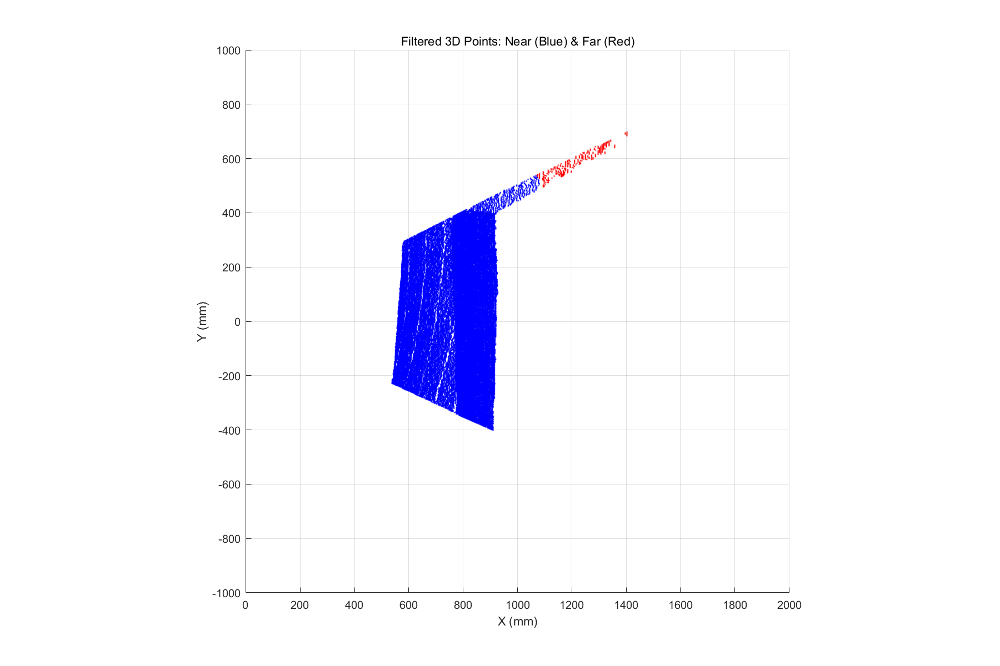
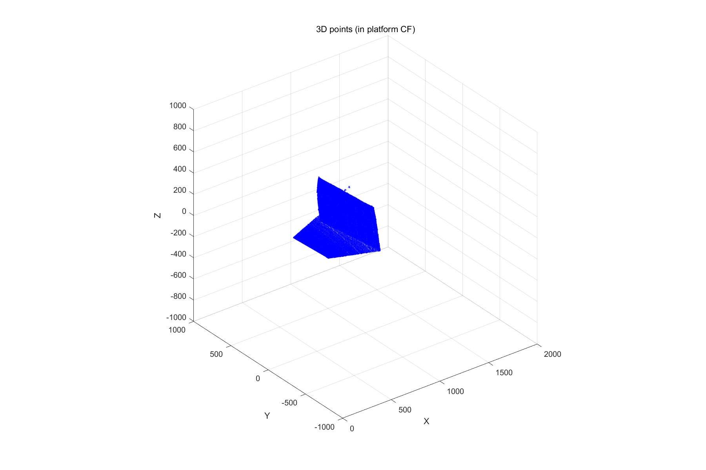
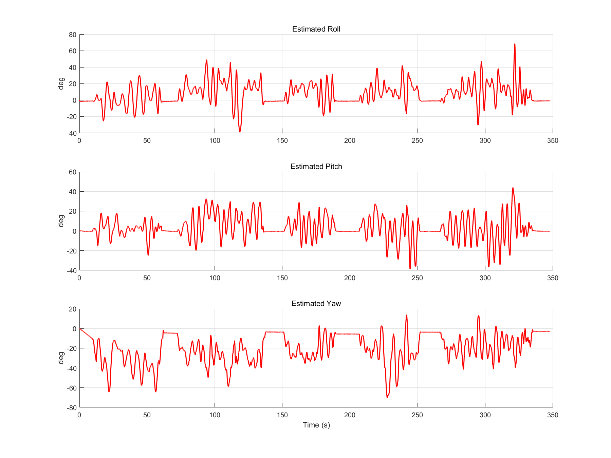
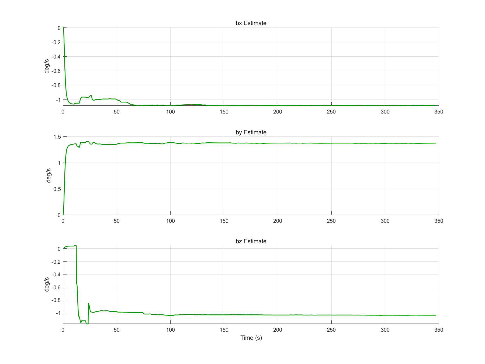

# 点云平面估计、IMU 姿态估计与增广状态 EKF

本仓库整理了四个基于 MATLAB 实现、可相互独立使用的机器人状态估计算法模块：三维点云平面估计、三轴陀螺仪恒定偏置估计、平面法向量坐标变换与方向关联，以及联合估计 ZYX Euler 姿态和三轴陀螺仪偏置的六维增广状态 EKF。所有公共接口统一使用 SI 单位，核心实现只依赖基础 MATLAB。

四个模块可以单独用于算法验证，也可以组成一条几何感知与状态估计链路：首先从局部三维点集拟合平面并统一法向量方向；随后将局部法向量旋转至全局坐标系并关联到已知参考方向；同时可利用稀疏姿态观测离线估计陀螺仪偏置；最后以高频 IMU 角速度执行 EKF 预测，并利用已经关联的平面法向量进行低频观测更新。

本仓库直接接收数值形式的三维点坐标，不包含原始深度图生成、图像分割、ROI 提取、传感器数据集或实时采集管线。

## 模块概览

| 模块 | 主要功能 | 公共接口 |
|---|---|---|
| `point-cloud-plane-estimation` | 使用 SVD 拟合三维点集的最小二乘平面，评估共面性，并提供平面姿态和点云刚体变换工具 | `fitPlaneSVD`、`evaluatePointCloudPlanarity`、`estimatePoseFromPlane`、`transformPointCloudZYX` |
| `gyro-bias-estimation` | 根据高频角速度和稀疏姿态观测估计恒定三轴偏置，并重建完整姿态序列 | `estimateGyroscopeBias`、`integrateEulerAttitude` |
| `plane-normal-association` | 将机体系法向量转换至全局坐标系，并按照方向夹角和容差门限匹配参考法向量 | `associatePlaneNormal` |
| `augmented-state-ekf` | 使用 IMU 预测和有向平面法向量更新，联合估计姿态与陀螺仪偏置 | `initializeAttitudeBiasEKF`、`predictAttitudeBiasEKF`、`updatePlaneNormalEKF` |

统一约定如下：

- 姿态排列为 $[\phi,\theta,\psi]^\mathsf T=[\text{roll},\text{pitch},\text{yaw}]^\mathsf T$；
- 旋转顺序采用 ZYX Euler convention，机体系到全局坐标系的旋转矩阵为 $R=R_z(\psi)R_y(\theta)R_x(\phi)$；
- 姿态使用 rad，角速度和陀螺仪偏置使用 rad/s，时间使用 s；
- 三维点坐标和平面距离使用 m；
- 平面法向量具有方向，因此 $\boldsymbol n$ 与 $-\boldsymbol n$ 不等价；
- 各模块的 `private` 目录保存内部运动学、解析 Jacobian 和数值稳定性辅助函数，不构成公共接口。

## 陀螺仪偏置估计

### 1. 角速度模型

陀螺仪测量模型写为

$$
\boldsymbol\omega_m
=\boldsymbol\omega+\boldsymbol b+\boldsymbol n_g,
$$

其中 $\boldsymbol\omega_m$ 为测量角速度，$\boldsymbol\omega$ 为真实机体系角速度，$\boldsymbol b$ 为待估计的恒定三轴偏置，$\boldsymbol n_g$ 为测量噪声。

对 ZYX Euler 姿态 $\boldsymbol\eta=[\phi,\theta,\psi]^\mathsf T$，机体系角速度到姿态角速度的映射为

$$
\dot{\boldsymbol\eta}
=E(\phi,\theta)(\boldsymbol\omega_m-\boldsymbol b),
$$

$$
E(\phi,\theta)=
\begin{bmatrix}
1 & \sin\phi\tan\theta & \cos\phi\tan\theta \\
0 & \cos\phi & -\sin\phi \\
0 & \sin\phi/\cos\theta & \cos\phi/\cos\theta
\end{bmatrix}.
$$

代码对每个角速度采样采用零阶保持，并使用显式 Euler 方法积分：

$$
\boldsymbol\eta_k
=\boldsymbol\eta_{k-1}
+\Delta t_k E(\boldsymbol\eta_{k-1})
(\boldsymbol\omega_{m,k-1}-\boldsymbol b).
$$

### 2. 稀疏姿态观测目标函数

设姿态观测只在索引集合 $\mathcal O$ 中出现，且某些 roll、pitch 或 yaw 分量可能缺失。偏置通过最小化有效分量的周期角度残差获得：

$$
J(\boldsymbol b)=
\sum_{j\in\mathcal O}
\sum_{c\in\mathcal V_j}
\operatorname{wrap}
\left(
\hat\eta_c(k_j;\boldsymbol b)-\eta_{c,j}
\right)^2,
$$

其中 $\mathcal V_j$ 表示第 $j$ 个观测中非 `NaN` 的有效分量。角度差通过 `atan2(sin(delta), cos(delta))` 包裹到主值区间，以避免跨越 $\pm\pi$ 时产生虚假大残差。优化使用基础 MATLAB 的 `fminsearch`，不需要 Optimization Toolbox。

## 点云平面估计

### 1. SVD 最小二乘拟合

给定 $N$ 个三维点 $\boldsymbol p_i$，首先计算质心

$$
\bar{\boldsymbol p}=\frac{1}{N}\sum_{i=1}^{N}\boldsymbol p_i,
$$

并构造去中心化矩阵

$$
A=
\begin{bmatrix}
(\boldsymbol p_1-\bar{\boldsymbol p})^\mathsf T\\
\vdots\\
(\boldsymbol p_N-\bar{\boldsymbol p})^\mathsf T
\end{bmatrix}.
$$

对 $A=U\Sigma V^\mathsf T$ 执行 SVD，最小奇异值对应的右奇异向量即为最小化点面正交距离平方和的单位法向量。实现要求点集至少在两个独立的平面内方向上具有跨度，因此会拒绝少于三个点或近似共线的退化输入。

SVD 本身只能确定法向轴，无法区分 $\boldsymbol n$ 与 $-\boldsymbol n$。`fitPlaneSVD` 使用已知视点 $\boldsymbol v$ 统一方向，使

$$
\boldsymbol n^\mathsf T(\boldsymbol v-\bar{\boldsymbol p})>0.
$$

若视点位于拟合平面内，法向方向无法确定，函数会明确报错，而不是任意选择符号。

### 2. 点面残差与共面性

第 $i$ 个点到拟合平面的有符号距离为

$$
d_i=(\boldsymbol p_i-\bar{\boldsymbol p})^\mathsf T\boldsymbol n.
$$

模块返回最大绝对距离、RMS 距离和奇异值比 $\sigma_3/\sigma_2$。`evaluatePointCloudPlanarity` 使用调用方提供的距离门限判断点集是否近似共面，不在内部绑定特定传感器分辨率或场景阈值。

### 3. 平面姿态与刚体变换

对于已经统一方向的法向量 $\boldsymbol n=[n_x,n_y,n_z]^\mathsf T$，单个平面可确定与法向一致的 roll 和 pitch：

$$
\phi=\operatorname{atan2}(n_y,n_z),
\qquad
\theta=\sin^{-1}(-n_x).
$$

绕法向量的 yaw 无法由单个平面独立观测。原点到平面的无符号法向距离为 $|\bar{\boldsymbol p}^\mathsf T\boldsymbol n|$。模块还提供通用 ZYX 刚体变换

$$
\boldsymbol p_{\mathrm{target}}
=R_z(\psi)R_y(\theta)R_x(\phi)\boldsymbol p_{\mathrm{source}}
+\boldsymbol t.
$$

## 平面法向量关联

输入局部法向量 $\boldsymbol n_b$ 后，算法首先检查其有限性和模长，然后将其归一化并旋转至全局坐标系：

$$
\boldsymbol n_g=R_z(\psi)R_y(\theta)R_x(\phi)\boldsymbol n_b.
$$

给定 $M$ 个全局参考方向 $\boldsymbol r_i$，每个参考向量同样被归一化。算法计算有向夹角

$$
\alpha_i=cos^{-1}
\left(
\operatorname{clip}(\boldsymbol n_g^\mathsf T\boldsymbol r_i,-1,1)
\right),
$$

并选择

$$
i^*=\operatorname*{arg\,min}_{i=1,\ldots,M}\alpha_i.
$$

仅当 $\alpha_{i^*}$ 不超过调用方提供的 `toleranceRad` 时返回 $i^*$，否则返回 `0`。零向量或非有限局部法向量也会被标记为无法关联。该接口不硬编码地面、墙面或天花板，参考方向及其语义由调用方定义。

## 六维增广状态 EKF

### 1. 状态与预测模型

滤波状态定义为

$$
\boldsymbol x=
\begin{bmatrix}
\phi & \theta & \psi & b_x & b_y & b_z
\end{bmatrix}^{\mathsf T}.
$$

姿态使用非线性 ZYX Euler 运动学传播，偏置采用常值状态模型：

$$
\boldsymbol\eta_k^-
=\boldsymbol\eta_{k-1}^+
+\Delta t_k E(\boldsymbol\eta_{k-1}^+)
(\boldsymbol\omega_{m,k-1}-\boldsymbol b_{k-1}^+),
$$

$$
\boldsymbol b_k^-=\boldsymbol b_{k-1}^+.
$$

实现中解析构造离散状态 Jacobian $F_k$ 和陀螺仪噪声输入 Jacobian $G_k$，协方差预测为

$$
P_k^-=F_kP_{k-1}^+F_k^\mathsf T
+G_k\left(\sigma_g^2I_3\right)G_k^\mathsf T.
$$

### 2. 平面法向量观测模型

当局部测量法向量已经与全局参考方向 $\boldsymbol n_g$ 完成关联时，EKF 预测该参考法向量在机体系下的表达：

$$
\boldsymbol h(\boldsymbol x)=R(\phi,\theta,\psi)^\mathsf T\boldsymbol n_g.
$$

测量模型为

$$
\boldsymbol z=\boldsymbol h(\boldsymbol x)+\boldsymbol v,
\qquad
\boldsymbol v\sim\mathcal N(\boldsymbol 0,\sigma_n^2I_3).
$$

代码分别对 roll、pitch 和 yaw 解析求导，构造

$$
H_k=
\begin{bmatrix}
\partial\boldsymbol h/\partial\boldsymbol\eta & 0_{3\times3}
\end{bmatrix}.
$$

### 3. Joseph-form 更新

新息、创新协方差和 Kalman 增益分别为

$$
\boldsymbol y_k=\boldsymbol z_k-\boldsymbol h(\boldsymbol x_k^-),
$$

$$
S_k=H_kP_k^-H_k^\mathsf T+R_k,
\qquad
K_k=P_k^-H_k^\mathsf TS_k^{-1}.
$$

状态更新为

$$
\boldsymbol x_k^+=\boldsymbol x_k^-+K_k\boldsymbol y_k.
$$

协方差使用 Joseph form，而不是简化的 $(I-KH)P$：

$$
P_k^+
=(I-K_kH_k)P_k^-(I-K_kH_k)^\mathsf T
+K_kR_kK_k^\mathsf T.
$$

每次预测和更新后都会显式对称化协方差。运动学计算还会限制 $|\cos\theta|$ 的最小值，以避免在 Euler 奇异点附近直接除零；该处理只提供数值保护，并不会消除 Euler 表示本身的奇异性。

## 代码结构

```text
portfolio/
├── point-cloud-plane-estimation/
│   ├── fitPlaneSVD.m
│   ├── evaluatePointCloudPlanarity.m
│   ├── estimatePoseFromPlane.m
│   ├── transformPointCloudZYX.m
│   └── private/
├── gyro-bias-estimation/
│   ├── estimateGyroscopeBias.m
│   ├── integrateEulerAttitude.m
│   └── private/
├── plane-normal-association/
│   ├── associatePlaneNormal.m
│   └── private/
└── augmented-state-ekf/
    ├── initializeAttitudeBiasEKF.m
    ├── predictAttitudeBiasEKF.m
    ├── updatePlaneNormalEKF.m
    └── private/
```

| 文件 | 作用 |
|---|---|
| [`fitPlaneSVD.m`](point-cloud-plane-estimation/fitPlaneSVD.m) | 使用 SVD 拟合最小二乘平面，按视点统一法向量方向，并返回残差与奇异值诊断 |
| [`evaluatePointCloudPlanarity.m`](point-cloud-plane-estimation/evaluatePointCloudPlanarity.m) | 根据最大点面距离门限评估点集共面性 |
| [`estimatePoseFromPlane.m`](point-cloud-plane-estimation/estimatePoseFromPlane.m) | 根据有向平面法向量计算 roll、pitch 和原点到平面的法向距离 |
| [`transformPointCloudZYX.m`](point-cloud-plane-estimation/transformPointCloudZYX.m) | 使用 ZYX Euler 姿态和平移执行三维点云刚体变换 |
| [`estimateGyroscopeBias.m`](gyro-bias-estimation/estimateGyroscopeBias.m) | 使用稀疏姿态观测优化三轴恒定陀螺仪偏置，并返回重建姿态和优化诊断 |
| [`integrateEulerAttitude.m`](gyro-bias-estimation/integrateEulerAttitude.m) | 使用去偏置机体系角速度积分 ZYX Euler 姿态 |
| [`associatePlaneNormal.m`](plane-normal-association/associatePlaneNormal.m) | 将局部法向量转换到全局坐标系并执行通用参考方向关联 |
| [`initializeAttitudeBiasEKF.m`](augmented-state-ekf/initializeAttitudeBiasEKF.m) | 根据初始均值和标准差构造六维状态及对角协方差 |
| [`predictAttitudeBiasEKF.m`](augmented-state-ekf/predictAttitudeBiasEKF.m) | 执行非线性姿态传播、解析线性化和陀螺仪噪声传播 |
| [`updatePlaneNormalEKF.m`](augmented-state-ekf/updatePlaneNormalEKF.m) | 使用任意已关联全局法向量执行 EKF 观测更新 |

`private` 中的内部函数按模块封装以下实现：点云刚体变换所需的 ZYX 旋转矩阵、Euler 运动学矩阵、状态与输入解析 Jacobian、平面法向量观测 Jacobian、Joseph-form 协方差更新、向量安全归一化、Euler 奇异点数值保护和协方差对称化。

## 公共接口

### 1. 点云平面估计

```matlab
[planeNormal, centroid, diagnostics] = ...
    fitPlaneSVD(points, viewpoint)
```

| 输入 | 形状 | 含义 |
|---|---:|---|
| `points` | `N x 3` | 三维点坐标，每行一个点，单位为 m |
| `viewpoint` | 3 元向量 | 用于统一法向方向的观察点，与点云位于同一坐标系，单位为 m |

`planeNormal` 是朝向视点的 `3 x 1` 单位法向量，`centroid` 是点云质心。`diagnostics` 包含三个奇异值、各点有符号距离、最大距离、RMS 距离、平面性奇异值比、点数和方向内积。

```matlab
[isPlanar, maxDistance, rmsDistance] = ...
    evaluatePointCloudPlanarity( ...
    points, planeNormal, centroid, distanceTolerance)
```

`distanceTolerance` 是非负最大允许点面距离，单位为 m。函数会先归一化输入法向量，再计算全部点面残差。

```matlab
[rollPitchRad, normalDistance] = ...
    estimatePoseFromPlane(planeNormal, centroid)

transformedPoints = transformPointCloudZYX( ...
    points, attitudeRad, translation)
```

`rollPitchRad` 返回 `[roll; pitch]`，单位为 rad；`normalDistance` 与点坐标使用相同长度单位。点云变换采用 $R_zR_yR_x$ 顺序，`translation` 与点云使用相同单位。

### 2. 陀螺仪偏置估计

```matlab
[biasRadPerSec, attitudeEstimateRad, diagnostics] = ...
    estimateGyroscopeBias( ...
    timeSec, gyroRadPerSec, initialAttitudeRad, ...
    measurementIndices, measuredAttitudeRad, ...
    initialBiasRadPerSec)
```

| 输入 | 形状 | 含义 |
|---|---:|---|
| `timeSec` | `N` 元向量 | 严格递增的时间戳，单位为 s |
| `gyroRadPerSec` | `3 x N` | 三轴角速度测量值，单位为 rad/s |
| `initialAttitudeRad` | `3 x 1` | 初始 `[roll; pitch; yaw]`，单位为 rad |
| `measurementIndices` | `M` 元向量 | 唯一、递增且位于有效范围内的姿态观测索引 |
| `measuredAttitudeRad` | `3 x M` | 稀疏姿态观测，单位为 rad；允许按分量使用 `NaN` 表示缺失 |
| `initialBiasRadPerSec` | `3 x 1` | 可省略的优化初值，默认 `zeros(3,1)`，单位为 rad/s |

输出 `biasRadPerSec` 为 `3 x 1` 偏置估计，`attitudeEstimateRad` 为 `3 x N` 完整姿态序列。`diagnostics` 包含 `finalCost`、`exitFlag`、`optimizerOutput` 和 `validResidualCount`。

```matlab
attitudeRad = integrateEulerAttitude( ...
    timeSec, gyroRadPerSec, initialAttitudeRad, biasRadPerSec)
```

该函数直接执行姿态积分，输入时间和单位约定与偏置估计接口一致。

### 3. 平面法向量关联

```matlab
[referenceIndex, minimumAngleRad, globalNormal] = ...
    associatePlaneNormal( ...
    localNormal, attitudeRad, referenceNormals, toleranceRad)
```

| 输入 | 形状 | 含义 |
|---|---:|---|
| `localNormal` | `3 x 1` | 机体系下的有向平面法向量 |
| `attitudeRad` | `3 x 1` | 当前 ZYX Euler 姿态，单位为 rad |
| `referenceNormals` | `3 x M` | 全局坐标系下的参考法向量集合 |
| `toleranceRad` | 标量 | 接受关联的最大方向夹角，范围为 `[0,pi]` |

`referenceIndex` 为匹配的参考列索引；无法关联时返回 `0`。`minimumAngleRad` 返回最小夹角，`globalNormal` 返回归一化后的全局法向量。局部输入退化时，函数返回 `0`、`Inf` 和 `NaN(3,1)`；参考集合包含零向量时会抛出错误。

### 4. 增广状态 EKF

```matlab
[state, covariance] = initializeAttitudeBiasEKF( ...
    initialAttitudeRad, initialBiasRadPerSec, ...
    attitudeStdRad, biasStdRadPerSec)
```

四个输入均为 `3 x 1` 向量。前两个分别给出姿态和偏置初值，后两个给出对应标准差。函数返回 `6 x 1` 状态和 `6 x 6` 对角初始协方差。

```matlab
[predictedState, predictedCovariance] = ...
    predictAttitudeBiasEKF( ...
    priorState, priorCovariance, gyroMeasurementRadPerSec, ...
    deltaTimeSec, gyroNoiseStdRadPerSec)
```

- `priorState`：`6 x 1` 先验状态；
- `priorCovariance`：`6 x 6` 先验协方差；
- `gyroMeasurementRadPerSec`：`3 x 1` 机体系角速度测量，单位为 rad/s；
- `deltaTimeSec`：正数预测间隔，单位为 s；
- `gyroNoiseStdRadPerSec`：非负标量陀螺仪噪声标准差，单位为 rad/s。

```matlab
[posteriorState, posteriorCovariance, innovation] = ...
    updatePlaneNormalEKF( ...
    priorState, priorCovariance, measuredNormalBody, ...
    referenceNormalGlobal, measurementStd)
```

`measuredNormalBody` 和 `referenceNormalGlobal` 均为有向三维法向量；函数会在更新前归一化二者。`measurementStd` 是法向量三个分量共享的正数标准差。退化或非有限法向量会触发明确错误。

## 使用示例

每个模块都可以独立加入 MATLAB path。若需要组合使用，可一次加入四个模块根目录；无需手动加入 `private` 目录。以下示例假设 MATLAB 当前目录为本仓库根目录 `portfolio`。

### 1. SVD 平面拟合与共面性检查

```matlab
planeModule = fullfile(pwd, "point-cloud-plane-estimation");
addpath(planeModule);

trueNormal = [0.25; -0.35; 0.902773504263389];
trueNormal = trueNormal / norm(trueNormal);
trueCentroid = [0.35; -0.20; 1.10];

basisU = cross(trueNormal, [0; 0; 1]);
basisU = basisU / norm(basisU);
basisV = cross(trueNormal, basisU);
[u, v] = meshgrid(linspace(-0.4, 0.4, 9), ...
    linspace(-0.3, 0.3, 9));
points = trueCentroid.' + u(:) * basisU.' + v(:) * basisV.';

normalOffsets = 1e-4 * cos(pi * u(:) / 0.4) .* ...
    cos(pi * v(:) / 0.3);
normalOffsets = normalOffsets - mean(normalOffsets);
points = points + normalOffsets * trueNormal.';
viewpoint = trueCentroid + 2 * trueNormal;

[planeNormal, centroid, diagnostics] = ...
    fitPlaneSVD(points, viewpoint);
[isPlanar, maxDistance, rmsDistance] = ...
    evaluatePointCloudPlanarity( ...
    points, planeNormal, centroid, 1.1e-4);
[rollPitchRad, normalDistance] = ...
    estimatePoseFromPlane(planeNormal, centroid);
transformedPoints = transformPointCloudZYX( ...
    points, [0.2; -0.1; 0.3], [0.4; -0.2; 0.7]);
```

该示例生成带确定性法向扰动的近似平面点集。门限 `1.1e-4 m` 下 `isPlanar` 返回 `true`；门限应根据实际传感器噪声和应用尺度由调用方确定。

### 2. 合成陀螺仪偏置估计

```matlab
biasModule = fullfile(pwd, "gyro-bias-estimation");
addpath(biasModule);

timeSec = 0:0.05:8;
trueRateRadPerSec = repmat([0.025; -0.018; 0.030], ...
    1, numel(timeSec));
trueBiasRadPerSec = [0.012; -0.009; 0.007];
gyroRadPerSec = trueRateRadPerSec + trueBiasRadPerSec;
initialAttitudeRad = [0.05; -0.04; 0.10];

trueAttitudeRad = integrateEulerAttitude( ...
    timeSec, trueRateRadPerSec, initialAttitudeRad, zeros(3, 1));
measurementIndices = 1:10:numel(timeSec);
measuredAttitudeRad = trueAttitudeRad(:, measurementIndices);
measuredAttitudeRad(3, 2) = NaN;

[estimatedBiasRadPerSec, estimatedAttitudeRad, diagnostics] = ...
    estimateGyroscopeBias( ...
    timeSec, gyroRadPerSec, initialAttitudeRad, ...
    measurementIndices, measuredAttitudeRad, zeros(3, 1));

biasErrorRadPerSec = norm( ...
    estimatedBiasRadPerSec - trueBiasRadPerSec)
```

### 3. 法向量方向关联

```matlab
associationModule = fullfile(pwd, "plane-normal-association");
addpath(associationModule);

referenceNormals = [ ...
    0, -1,  0; ...
    0,  0,  1; ...
    1,  0,  0];
attitudeRad = zeros(3, 1);
localNormal = referenceNormals(:, 2);

[referenceIndex, minimumAngleRad, globalNormal] = ...
    associatePlaneNormal( ...
    localNormal, attitudeRad, referenceNormals, 1e-6)
```

该示例返回 `referenceIndex = 2` 和 `minimumAngleRad = 0`。

### 4. EKF 预测与法向量更新

```matlab
ekfModule = fullfile(pwd, "augmented-state-ekf");
addpath(ekfModule);

[state, covariance] = initializeAttitudeBiasEKF( ...
    zeros(3, 1), zeros(3, 1), ...
    [5; 5; 10] * pi / 180, ...
    [2; 2; 2] * pi / 180);

gyroMeasurementRadPerSec = [0.01; -0.015; 0.008];
[state, covariance] = predictAttitudeBiasEKF( ...
    state, covariance, gyroMeasurementRadPerSec, 0.01, 0.005);

measuredFloorNormalBody = [0; 0; 1];
referenceFloorNormalGlobal = [0; 0; 1];
[state, covariance, innovation] = updatePlaneNormalEKF( ...
    state, covariance, measuredFloorNormalBody, ...
    referenceFloorNormalGlobal, 0.02);
```

实际传感器管线中，应先由上游算法获得有向局部法向量，再通过 `associatePlaneNormal` 确认对应参考方向；只有关联有效时才调用 EKF 更新。

## 实际数据运行结果

以下图片来自本地记录的 RGB-D 与 IMU 数据回放。原始传感器数据、回放环境和上游深度坐标转换不随本仓库分发；仓库只保留静态运行结果，用于展示算法的数据流和输出形态。

<table>
  <tr>
    <td align="center" width="50%">
      <br>
      按欧氏距离分层的三维点云：蓝色为近距离点，红色为远距离点
    </td>
    <td align="center" width="50%">
      <br>
      利用平面姿态与法向距离变换至平台坐标系的点云
    </td>
  </tr>
  <tr>
    <td align="center" width="50%">
      <br>
      增广状态 EKF 的 Roll、Pitch、Yaw 估计轨迹
    </td>
    <td align="center" width="50%">
      <br>
      注入恒定测试偏置后的三轴陀螺仪偏置收敛轨迹
    </td>
  </tr>
</table>

点云运行界面保留原实现的显示单位 mm，姿态和偏置曲线分别使用 degree 与 degree/s；作品集公共接口则统一采用 m、rad 和 rad/s。偏置检查向记录数据注入了 $[-1,\ 1.5,\ -1]^\mathsf T\ \mathrm{degree/s}$ 的恒定测试偏置，用于观察滤波器的收敛行为。图片展示的是一次完整离线回放结果，不代表公开数据集精度、真实传感器标定精度或实时性能基准。

## 合成输入数值验证

以下结果来自本地确定性合成烟雾检查，不需要外部数据文件或硬件连接。

| 检查项 | 结果 |
|---|---:|
| 已知恒定偏置的估计误差 | $4.10568935028\times10^{-11}\ \mathrm{rad/s}$ |
| 法向量预期参考索引 | `2` |
| 法向量实际返回索引 | `2` |
| 300 次 EKF 预测及周期更新后的协方差对称误差 | $0$ |
| 最终协方差最小特征值 | $1.86875552315\times10^{-6}$ |
| 解析观测 Jacobian 与中心差分的最大元素误差 | $6.72568001292\times10^{-10}$ |
| SVD 平面法向量角度误差 | $0\ \mathrm{rad}$ |
| SVD 平面质心误差 | $2.77555756156\times10^{-17}\ \mathrm{m}$ |
| 合成扰动点云最大点面距离 | $1.01234567904\times10^{-4}\ \mathrm{m}$ |
| 合成扰动点云 RMS 点面距离 | $5.55418364405\times10^{-5}\ \mathrm{m}$ |
| 最小奇异值与第二奇异值之比 | $2.86816810069\times10^{-4}$ |
| 平面姿态角误差 | $7.62142028251\times10^{-15}\ \mathrm{rad}$ |
| 点云刚体变换距离保持误差 | $4.44089209850\times10^{-16}\ \mathrm{m}$ |
| 预期拒绝的无效几何输入 | `5 / 5` |
| MATLAB 源文件数量 | `22` |
| Code Analyzer 问题数量 | `0` |

偏置检查使用已知恒定角速度、已知偏置和稀疏姿态观测，其中一个 yaw 观测被设为 `NaN`，用于确认按分量忽略缺失观测。估计误差为

$$
\left\|
\hat{\boldsymbol b}-\boldsymbol b_{\mathrm{true}}
\right\|_2.
$$

该检查中的真值轨迹和估计过程采用相同的 Euler 运动学与积分器，因此结果用于验证偏置目标函数、缺失观测处理和优化流程的一致性，不构成独立的传感器精度评估。

点云检查在已知平面内生成 $9\times9$ 个采样点，并加入幅值约为 $10^{-4}\ \mathrm m$ 的确定性法向扰动。验证内容包括法向量和质心恢复、宽松与严格距离门限的判定、单平面 roll/pitch 计算、刚体变换的距离保持性质，以及点数不足、共线点集、视点位于平面、零法向量和负距离门限五类失败输入。误差接近机器精度是该确定性构造的结果，不代表真实点云测量精度。

法向量关联检查从已知非零姿态和指定全局参考方向反向生成局部法向量，再验证坐标变换与关联结果。EKF 检查模拟静止平台和恒定陀螺仪偏置，执行 300 次预测，并每 5 步使用地面或墙面法向量更新。协方差对称误差定义为 $\|P-P^\mathsf T\|_F$；最小特征值为正，说明该次检查中协方差保持正定。

解析测量 Jacobian 使用步长 $10^{-7}$ 的中心差分进行独立数值复核。上述数值只验证当前实现的公式一致性和数值性质，不代表实际传感器的物理精度、实时运行速度、任意轨迹性能或公开数据集基准。

## 运行环境与依赖

- MATLAB R2024b；
- 核心算法只使用基础 MATLAB 函数；
- 偏置估计使用基础 MATLAB 提供的 `fminsearch`；
- 不需要 Optimization Toolbox、Computer Vision Toolbox、Image Processing Toolbox 或 Robotics System Toolbox；
- 不需要网络连接、机器人硬件、相机、IMU 设备或外部数据文件。

## 项目边界

- 仓库接收已经整理为数值数组的三维点坐标、时间戳、角速度、稀疏姿态观测和参考平面法向量；
- 点云模块从给定三维点集执行平面拟合，但不负责原始图像或深度图解码、相机标定、ROI 分割、去噪、下采样和离群点剔除；
- 平面关联只解决已知参考方向之间的数据关联，不自动建立地图或学习未知平面；
- EKF 只在调用方提供有效关联时执行观测更新，不包含实时消息调度或传感器同步；
- 仓库仅随附上述静态运行结果图，不随附数据集、回放接口、硬件接口或自动运行脚本。

## 局限性

- ZYX Euler 表示在 $\theta=\pm\pi/2$ 附近存在固有奇异性；代码中的余弦限幅只能避免直接除零，不能消除姿态表示退化；
- SVD 平面拟合采用普通最小二乘准则，对离群点不具备 RANSAC 或鲁棒损失提供的抗干扰能力；
- 共面性采用调用方指定的最大距离门限，代码不会根据点云尺度、采样密度或传感器噪声自动标定阈值；
- 法向量符号依赖有效视点先验；视点位于拟合平面时方向不可辨识，单个平面也无法独立确定 yaw；
- 姿态传播采用一阶显式 Euler 积分，精度依赖采样间隔和角运动幅度；
- 偏置估计将三轴偏置视为整段数据内的常量，不描述温漂、时变偏置或随机游走；
- `fminsearch` 是局部无导数优化方法，结果可能受初值、轨迹激励和可观测性影响；
- 偏置目标函数对所有有效姿态分量采用相同权重，没有使用分量相关的测量协方差；
- EKF 偏置状态采用常值模型，预测阶段没有加入独立的偏置过程噪声；
- EKF 使用 Euler 状态的加法修正，没有采用 quaternion、SO(3) manifold 或 error-state 表示；
- 平面法向量必须提前确定方向，输入翻转会改变关联结果和 EKF 新息；
- 平面观测噪声使用 $\sigma_n^2I_3$，无法表示三个分量之间的相关性或各向异性；
- 关联函数使用固定角度门限，EKF 更新内部不执行 Mahalanobis gating、异常值剔除或鲁棒损失处理；
- 平面法向量观测不会直接修正 bias 分量，偏置通过姿态—偏置协方差的交叉项间接更新；
- 当前实现没有对真实传感器数据、长时间运行、实时计算负载或极端姿态轨迹进行公开基准测试。

## 作者

Wenshao Lyu
