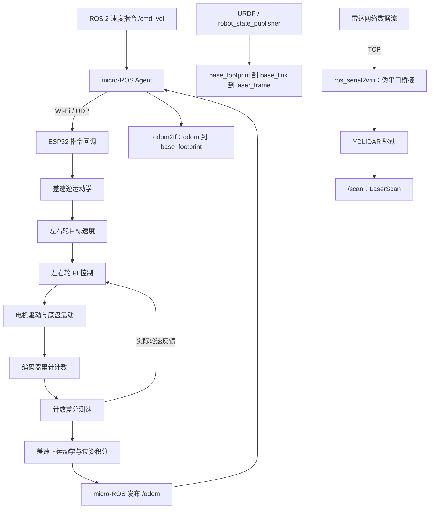
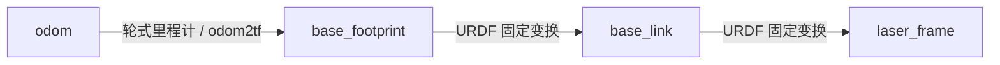

# 基于 ROS 2 与 ESP32 的差速底盘控制与里程计实现

本项目基于 FishBot／鱼香 ROS 教程完成差速移动机器人底盘的学习实现、参数配置、系统集成和实机调试。ESP32 接收 ROS 2 速度指令，通过差速逆运动学生成左右轮目标速度，再利用编码器反馈和 PI 控制驱动电机；同时计算轮式里程计，经 micro-ROS 发布到上位机，并通过 TF 和 URDF 建立底盘与雷达之间的坐标关系。

**项目已由作者完成实机测试。** 本目录整理其中的控制算法、固件及 ROS 2 集成代码，用于展示实现思路和系统数据流。

| 展示重点 | 实现内容 | 核心源码 |
| --- | --- | --- |
| 差速底盘运动学 | 车体速度与左右轮速度的正逆转换、编码器测速 | [Kinematics.cpp](motion_control/lib/Kinematics/Kinematics.cpp) |
| 轮速闭环控制 | 左右轮独立控制、积分累加限幅和电机输出限幅 | [PidController.cpp](motion_control/lib/PidController/PidController.cpp) |
| 轮式里程计 | 根据轮速更新平面位置和航向，并生成 ROS 里程计消息 | [main.cpp](motion_control/src/main.cpp) |
| ROS 2 系统集成 | micro-ROS 通信、里程计转 TF、机器人描述和雷达接入 | [bringup.launch.py](fishbot_ws/src/fishbot_bringup/launch/bringup.launch.py) |

## 系统数据流



固件将通信与本地控制分成两个执行上下文：Arduino `loop()` 负责编码器读取、轮速更新、位姿积分和电机控制；单独的 FreeRTOS 任务运行 micro-ROS executor，处理速度订阅和里程计定时发布。

雷达通过独立的网络转伪串口链路接入上位机，不经过轮式里程计算法。当前工作区使用雷达驱动发布扫描数据，未将雷达观测融合进底盘位姿估计。

## 核心算法

### 1. 编码器差分测速

设第 $i$ 个轮子的编码器累计计数为 $N_{i,k}$，每个计数对应的轮子前进距离为 $c_i$，相邻更新时间差为 $\Delta t_{\mathrm{ms}}$。轮速按下式计算：

```math
\Delta N_{i,k}=N_{i,k}-N_{i,k-1},
\qquad
v_{i,k}=\frac{\Delta N_{i,k}c_i}{\Delta t_{\mathrm{ms}}}\times1000.
```

$c_i$ 的单位为 mm/计数，得到的轮速单位为 mm/s。当前左右轮均采用 `0.10658 mm/计数`，轮速在代码中存储为 `int16_t`，因此会截断小数部分。

实现入口：[Kinematics::update_motor_speed](motion_control/lib/Kinematics/Kinematics.cpp)。

### 2. 差速正逆运动学

设轮距为 $L$，车体前向线速度为 $v$，角速度为 $\omega$。逆运动学将车体速度指令分解为左右轮目标速度：

```math
v_L^*=v-\frac{L\omega}{2},
\qquad
v_R^*=v+\frac{L\omega}{2}.
```

正运动学根据编码器测得的左右轮速度恢复车体速度：

```math
v=\frac{v_L+v_R}{2},
\qquad
\omega=\frac{v_R-v_L}{L}.
```

内部轮距和轮速分别采用 mm、mm/s，角速度采用 rad/s。ROS `Twist.linear.x` 的单位为 m/s，订阅回调先乘以 `1000`，再执行逆解；里程计发布前则将线速度转换回 m/s。

例如，使用当前轮距 $L=175\ \mathrm{mm}$，当指令为 $v=0.2\ \mathrm{m/s}$、$\omega=1\ \mathrm{rad/s}$ 时，逆解得到左右轮目标速度分别为 `112.5 mm/s` 和 `287.5 mm/s`。这是公式示例，不是实测性能数据。

### 3. 左右轮 PI 闭环控制

每个轮子使用独立的 `PidController` 对象。类中保留比例、积分和微分项，当前配置的 `Kd=0`，实际使用 **PI 控制**。

设目标轮速与反馈轮速之差为 $e_k$，积分累加量为 $S_k$，定义 $\mathrm{clip}(a,l,u)$ 为将 $a$ 限制在 $[l,u]$ 内：

```math
e_k=v_k^*-v_k,
```

```math
S_k=\mathrm{clip}(S_{k-1}+e_k,-2500,2500),
```

```math
u_k=\mathrm{clip}(K_p e_k+K_i S_k,-100,100).
```

左右轮均使用 $K_p=0.625$、$K_i=0.125$。积分累加限幅约束持续误差造成的累加量增长，输出限幅限制传给电机驱动接口的控制值。

该实现按每次控制循环累加误差，积分项没有显式乘以时间差；因此参数与采样周期有关。`loop()` 中设置了 `delay(10)`，实际周期还包含串口输出及计算耗时，不能直接视为固定的 100 Hz。

源码保留的微分项采用 `error_last - error`，当前因 `Kd=0` 不参与输出；若启用微分控制，需要重新核对符号、采样周期和参数。

实现入口：[PidController::update](motion_control/lib/PidController/PidController.cpp)，参数配置位于 [setup()](motion_control/src/main.cpp)。

### 4. 二维轮式里程计

里程计状态为平面位置 $(x,y)$ 和航向角 $\theta$。正运动学得到的线速度转换为 m/s，时间差转换为 s 后，先更新角度，再以更新后的角度累计位置：

```math
\theta_k=\theta_{k-1}+\omega_k\Delta t,
```

```math
x_k=x_{k-1}+v_k\Delta t\cos\theta_k,
\qquad
y_k=y_{k-1}+v_k\Delta t\sin\theta_k.
```

这与当前 `update_odom()` 的计算顺序一致。代码在角度更新后进行一次 $2\pi$ 加减，将普通小步长更新中越过 $\pm\pi$ 的航向拉回主值区间。

发布 `nav_msgs/msg/Odometry` 时，平面航向被转换为绕 Z 轴旋转的四元数：

```math
(q_x,q_y,q_z,q_w)
=\left(0,0,\sin\frac{\theta}{2},\cos\frac{\theta}{2}\right).
```

消息包含平面位置、航向、前向线速度和角速度。时间戳来自与 Agent 同步后的 micro-ROS epoch 时间。

## ROS 2 接口与坐标系

| 接口 | 消息类型 | 作用 |
| --- | --- | --- |
| `/cmd_vel` | `geometry_msgs/msg/Twist` | ESP32 使用 `linear.x` 和 `angular.z` 生成左右轮目标速度 |
| `/odom` | `nav_msgs/msg/Odometry` | ESP32 发布轮式里程计；父坐标系为 `odom`，子坐标系为 `base_footprint` |
| `/tf` | `tf2_msgs/msg/TFMessage` | `odom2tf` 将里程计位姿转换为 `odom → base_footprint` 的动态变换 |
| `/tf_static` | `tf2_msgs/msg/TFMessage` | `robot_state_publisher` 根据 URDF 发布底盘与雷达之间的固定变换 |
| `/scan` | `sensor_msgs/msg/LaserScan` | YDLIDAR 驱动发布扫描数据，坐标系为 `laser_frame` |

固件的速度订阅和里程计发布均使用 best-effort QoS；`odom2tf` 使用 `SensorDataQoS` 接收里程计，并保留消息的时间戳和坐标系名称。



当前 URDF 描述底盘与雷达的简化几何形状和安装关系；`base_link` 相对 `base_footprint` 的 Z 偏移为 `0.076 m`，`laser_frame` 相对 `base_link` 的 Z 偏移为 `0.075 m`。

## 当前实现参数

以下均为源码配置值，不代表实测频率、精度或最优控制参数。

| 参数 | 当前值 | 含义 |
| --- | --- | --- |
| 轮距 | `175 mm` | 差速运动学中的左右轮间距 |
| 左右轮距离系数 | `0.10658 mm/计数` | 编码器计数到轮子前进距离的换算系数 |
| 左右轮控制参数 | `Kp=0.625, Ki=0.125, Kd=0` | 当前采用 PI 控制 |
| 积分累加限幅 | `[-2500, 2500]` | 限制轮速误差累加量 |
| 电机控制输出限幅 | `[-100, 100]` | 传给电机驱动接口的控制值范围 |
| 本地循环延时 | `10 ms` | 实际周期还包含循环内工作耗时 |
| 里程计发布定时器 | `50 ms` | 名义触发频率为 20 Hz，实际消息频率受调度和通信影响 |
| micro-ROS Agent | `UDP 8888` | 底盘控制与里程计的通信入口 |
| 雷达网络桥接 | `TCP 8889` | `tcp_server` 默认监听端口 |
| 雷达伪串口 | `/tmp/tty_laser` | bringup 覆盖后的桥接路径，与雷达配置一致 |

启动入口组织机器人描述、`odom2tf`、micro-ROS Agent、TCP 桥接和 YDLIDAR 驱动，并将雷达驱动的启动延后 5 秒，以留出桥接初始化时间。

## 代码导航

| 路径 | 内容 |
| --- | --- |
| [motion_control/src/main.cpp](motion_control/src/main.cpp) | ESP32 硬件初始化、控制参数、FreeRTOS 任务、速度回调和里程计发布 |
| [motion_control/lib/Kinematics](motion_control/lib/Kinematics) | 编码器测速、差速正逆解和位姿积分 |
| [motion_control/lib/PidController](motion_control/lib/PidController) | 轮速控制器、积分累加和输出限幅 |
| [fishbot_bringup/launch](fishbot_ws/src/fishbot_bringup/launch) | 系统启动和机器人描述发布 |
| [fishbot_bringup/src/odom2tf.cpp](fishbot_ws/src/fishbot_bringup/src/odom2tf.cpp) | 将里程计消息转换为动态 TF |
| [fishbot_description/urdf/fishbot.urdf](fishbot_ws/src/fishbot_description/urdf/fishbot.urdf) | 底盘与雷达的简化模型和固定坐标关系 |
| [ros_serial2wifi](fishbot_ws/src/ros_serial2wifi) | 网络与 Linux 伪串口之间的数据桥接；当前 bringup 使用 TCP 版本 |
| [micro-ROS-Agent](fishbot_ws/src/micro-ROS-Agent) | micro-ROS 与 ROS 2 通信使用的第三方 Agent |
| [micro_ros_msgs](fishbot_ws/src/micro_ros_msgs) | micro-ROS 相关消息定义 |
| [ydlidar_ros2](fishbot_ws/src/ydlidar_ros2) | 第三方 YDLIDAR 驱动与 SDK、扫描参数及启动文件 |

阅读顺序建议为：`main.cpp` 中的速度回调与控制循环 → `Kinematics.cpp` → `PidController.cpp` → 里程计发布回调 → `odom2tf.cpp` 和 bringup。

## 个人工作与参考来源

本项目基于 **FishBot／鱼香 ROS 教程**学习完成。个人工作集中在理解和实现教程中的底盘控制流程、配置运动学及控制参数、集成 ESP32 与 ROS 2 通信链路，并进行实机调试和测试。

差速运动学、PI 控制和编码器里程计属于本项目学习与实践的算法内容。目录中的教程衍生实现和第三方组件保留其来源，不将它们表述为独立提出的新算法或全部自主开发的软件。

| 来源／组件 | 在项目中的用途 |
| --- | --- |
| FishBot／鱼香 ROS 教程 | 底盘控制与 ROS 2 集成的学习参考；`ros_serial2wifi` 包保留 fishros 维护者信息 |
| [micro-ROS Agent](fishbot_ws/src/micro-ROS-Agent/README.md)、[micro_ros_msgs](fishbot_ws/src/micro_ros_msgs/README.md) | 上位机 Agent 与相关消息支持 |
| `micro_ros_platformio` | 固件中的 micro-ROS 集成接口 |
| `Esp32McpwmMotor`、`Esp32PcntEncoder` | 固件调用的电机驱动与编码器接口 |
| [YDLIDAR ROS 2 驱动](fishbot_ws/src/ydlidar_ros2/README.md) | 雷达设备接入和扫描数据发布 |

第三方组件的作者、使用说明和许可信息以其原始文件为准。

## 实机验证与当前范围

作者已完成项目的实机测试。本作品集保留代码与算法说明，当前未附带实机测量曲线或量化性能记录，因此不对定位精度、轮速跟踪误差、通信延迟或测试成功率给出数值结论。

当前实现覆盖速度指令接收、差速底盘控制、编码器里程计和 ROS 2／雷达集成。阅读代码时需要结合以下范围理解：

- 里程计采用平面差速模型，仅由轮速积分得到位姿，轮胎打滑、轮距及编码器换算误差会形成累积漂移；当前没有雷达／IMU 融合、SLAM 或自主导航模块。
- 控制与位姿更新采用离散计算；测速尚未处理零时间差，长时间停顿和大角度跳变也未作完整边界保护。
- 当前固件未加入速度命令超时停车、完整的 Agent 断线恢复状态机及跨任务共享数据同步保护。
- URDF 和雷达接入用于描述机器人与传感器关系，不构成完整动力学模型或导航系统。

## 作者

Wenshao Lyu


## 作品集发布副本

本目录用于展示代码、算法与实机集成经验。固件中的 Wi-Fi 名称和密码已替换为 `YOUR_WIFI_SSID` / `YOUR_WIFI_PASSWORD`，Agent 地址 `192.0.2.1` 为文档示例地址，不能直接用于实际连接。运行前需要在自己的环境中配置；不要将真实密码提交到仓库。

第三方组件及版本线索见[来源索引](../SOURCES.md)。本次整理只清理发布内容，没有重新连接硬件验证。
