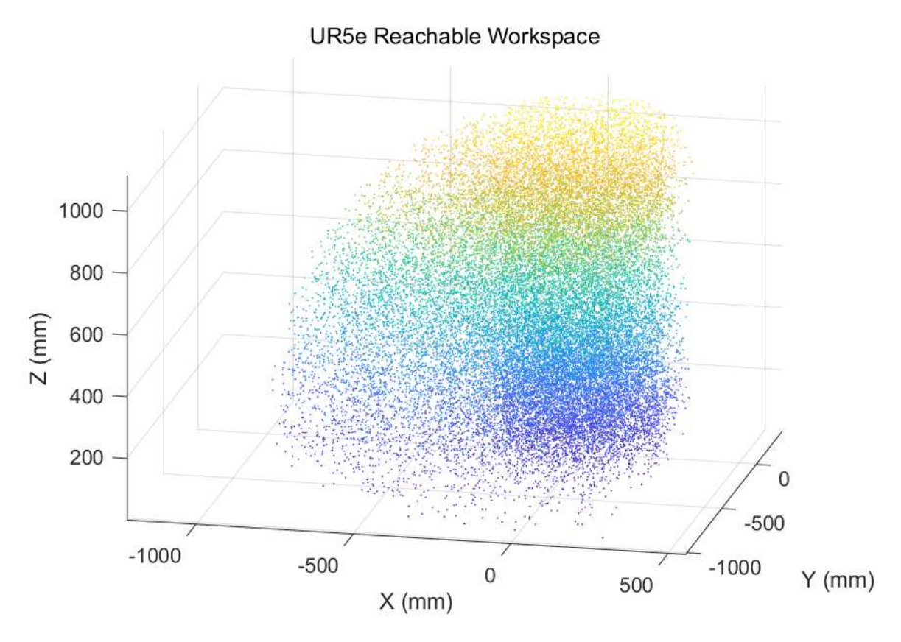
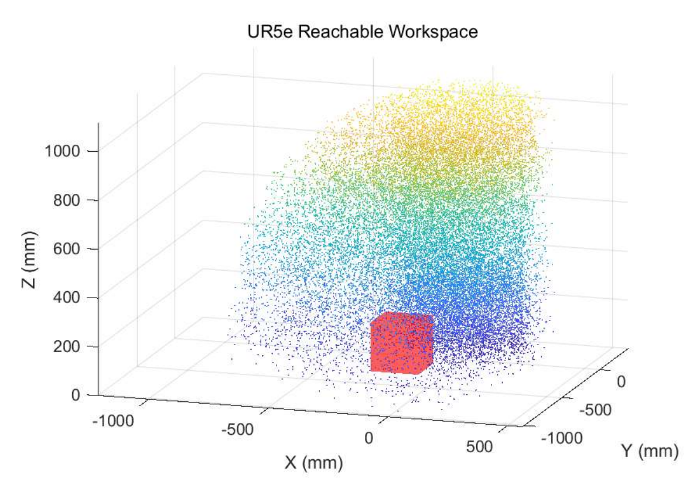
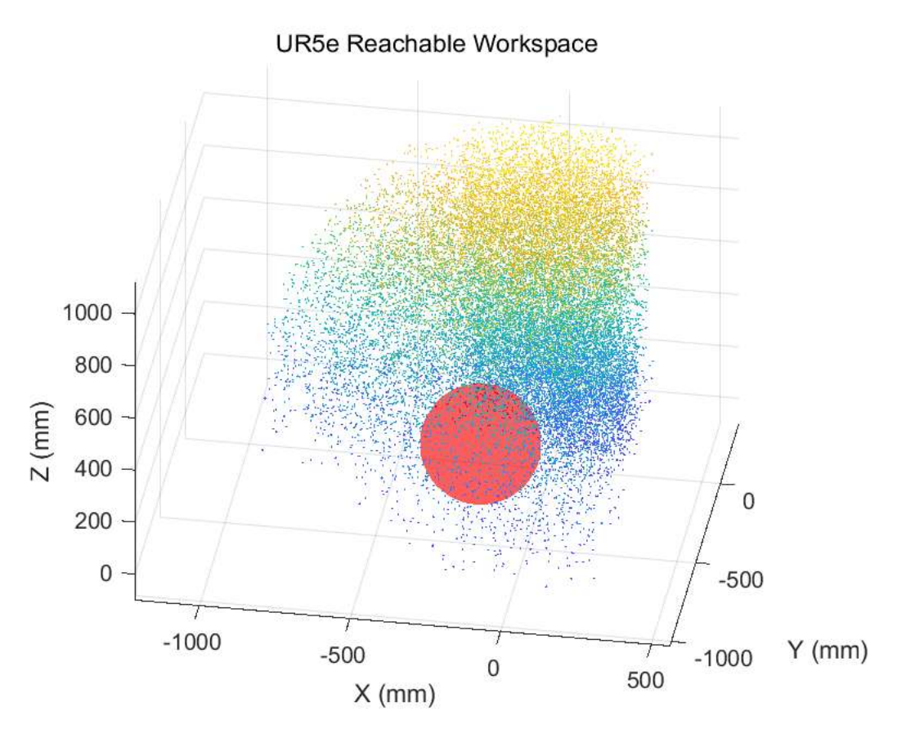
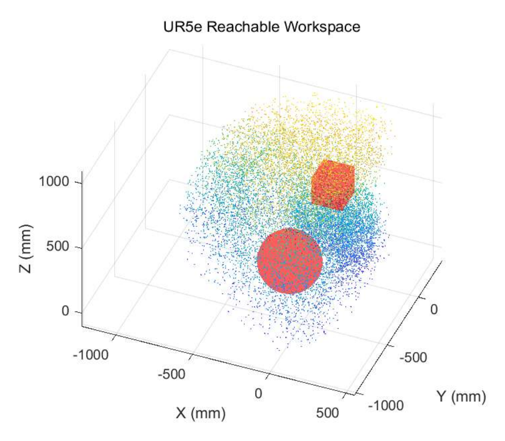
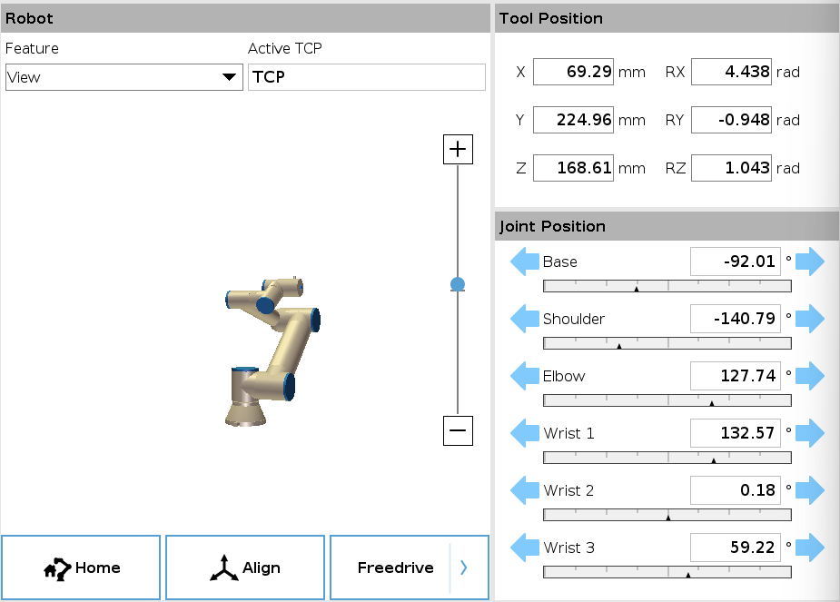
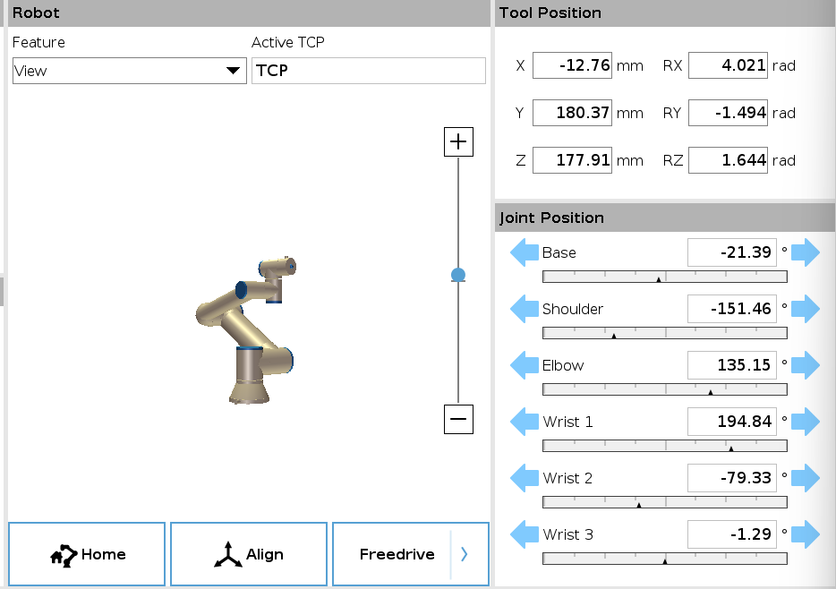
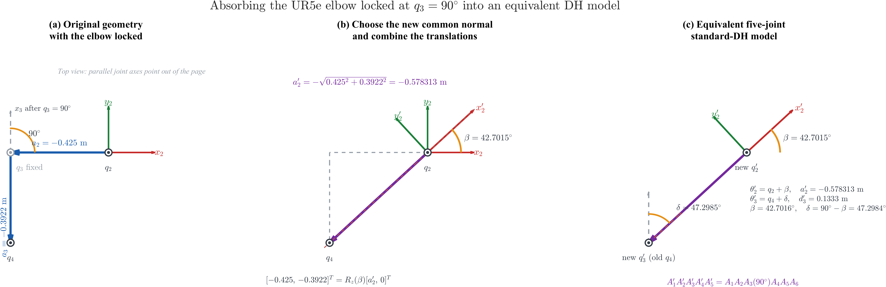
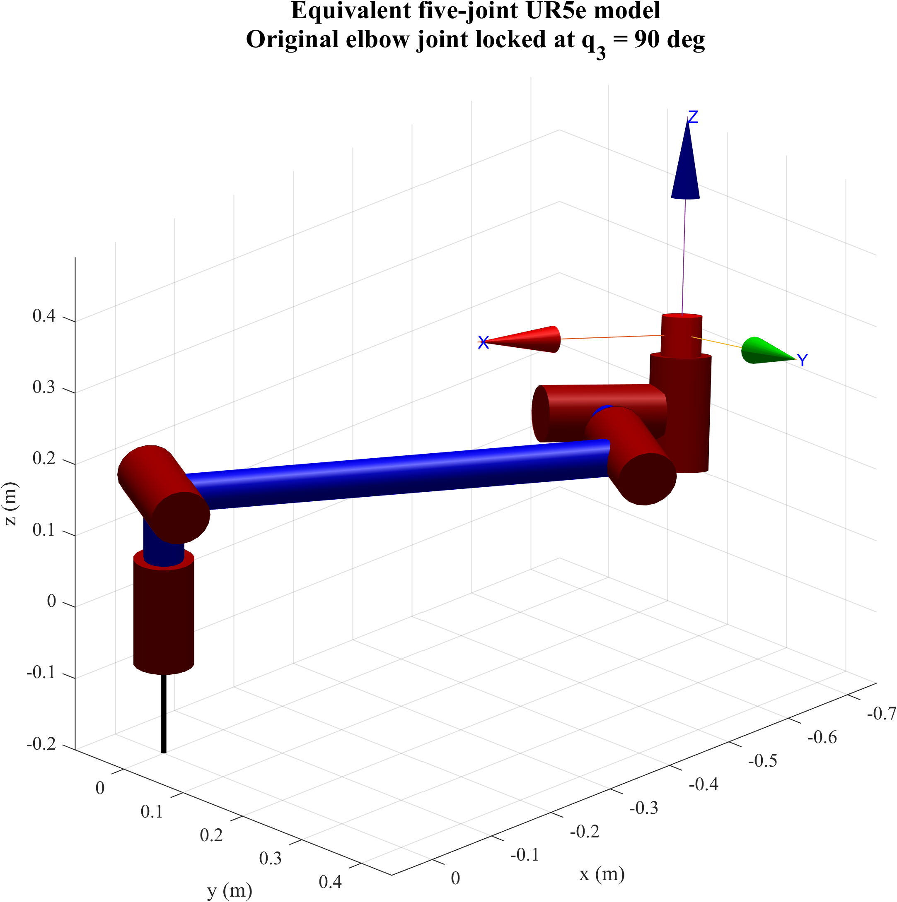

# UR5e 运动学建模、奇异性分析与碰撞检测算法

本仓库整理了基于 MATLAB 实现的 UR5e 运动学核心算法，包括标准 DH 正运动学、rotation vector 转换、几何 Jacobian、奇异性诊断、工作空间安全平面检查、简化障碍物碰撞检测，以及肘关节固定后的等效五自由度建模。核心函数均从 DH 参数和齐次变换出发实现，只依赖基础 MATLAB。

## 标准 UR5e 正运动学与碰撞检测

### 1. 标准 DH 正运动学

主函数接收六个关节角，根据标准 DH 参数依次构造相邻 frame 之间的齐次变换：

```math
{}^{i-1}T_i =
\begin{bmatrix}
\cos\theta_i & -\sin\theta_i\cos\alpha_i & \sin\theta_i\sin\alpha_i & a_i\cos\theta_i \\
\sin\theta_i & \cos\theta_i\cos\alpha_i & -\cos\theta_i\sin\alpha_i & a_i\sin\theta_i \\
0 & \sin\alpha_i & \cos\alpha_i & d_i \\
0 & 0 & 0 & 1
\end{bmatrix}.
```

通过有序连乘得到末端变换

```math
{}^0T_6 = {}^0T_1{}^1T_2{}^2T_3{}^3T_4{}^4T_5{}^5T_6,
```

同时记录 $`p_0`$ 至 $`p_6`$ 的 frame origin，用于后续工作空间与碰撞检查。

| 关节 $`i`$ | $`d_i`$ (m) | $`a_i`$ (m) | $`\alpha_i`$ (rad) |
|---:|---:|---:|---:|
| 1 | 0.1625 | 0 | $`\pi/2`$ |
| 2 | 0 | -0.4250 | 0 |
| 3 | 0 | -0.3922 | 0 |
| 4 | 0.1333 | 0 | $`\pi/2`$ |
| 5 | 0.0997 | 0 | $`-\pi/2`$ |
| 6 | 0.0996 | 0 | 0 |

### 2. Rotation vector 转换

末端旋转矩阵 $`R`$ 通过

```math
\theta = \cos^{-1}\left(\mathrm{clip}\left(\frac{\mathrm{tr}(R)-1}{2},-1,1\right)\right)
```

转换为 rotation vector $`\boldsymbol r=\theta\boldsymbol u`$。实现中分别处理以下情况：

- $`\theta\approx0`$：直接返回零向量；
- $`0<\theta<\pi`$：利用 $`R-R^\mathsf{T}`$ 恢复旋转轴；
- $`\theta\approx\pi`$：利用 $`(R+I)/2=\boldsymbol u\boldsymbol u^\mathsf{T}`$ 恢复旋转轴，避免除以接近零的 $`\sin\theta`$。

### 3. 工作空间安全平面

工作空间检查覆盖 $`p_1`$ 至 $`p_6`$，并要求所有 frame origin 位于三个安全平面的有效侧：

| 安全边界 | 有效区域 |
|---|---|
| 工作台平面 | $`z>0`$ |
| 后侧平面 | $`y<0.3\ \mathrm{m}`$ |
| 侧向平面 | $`x<0.3\ \mathrm{m}`$ |

位于边界上的点同样判定为无效。

### 4. 简化碰撞检测

机械臂相邻 frame origin 之间的部分被近似为零厚度线段。

对于球体，首先计算球心在线段所在直线上的投影参数，并将其限制在线段范围内：

```math
t=\mathrm{clip}\left(
\frac{(\boldsymbol c-\boldsymbol p_A)^\mathsf{T}(\boldsymbol p_B-\boldsymbol p_A)}
{\|\boldsymbol p_B-\boldsymbol p_A\|_2^2},0,1
\right).
```

若最近点与球心的距离不大于球体半径，则判定为碰撞；相切也计为碰撞。

对于轴对齐立方体，将其表示为 AABB，并使用 slab method 逐轴更新线段参数区间 $`[t_{\min},t_{\max}]`$。若三个轴对应区间的交集非空，则线段与 AABB 相交。

## 代码结构

| 文件 | 作用 |
|---|---|
| [`ur5e_forward_kinematics.m`](src/ur5e_forward_kinematics.m) | 组织 UR5e 正运动学、工作空间检查和障碍物碰撞检查 |
| [`dh_transform.m`](src/dh_transform.m) | 根据一行标准 DH 参数构造齐次变换矩阵 |
| [`rotation_matrix_to_rotvec.m`](src/rotation_matrix_to_rotvec.m) | 将旋转矩阵转换为 rotation vector，并处理 $`0`$ 和 $`\pi`$ 附近的特殊情况 |
| [`check_workspace.m`](src/check_workspace.m) | 检查各 frame origin 是否位于安全平面的有效侧 |
| [`segment_sphere_collision.m`](src/segment_sphere_collision.m) | 检查三维线段与球体是否相交或相切 |
| [`segment_aabb_collision.m`](src/segment_aabb_collision.m) | 使用 slab method 检查三维线段与 AABB 是否相交 |
| [`ur5e_geometric_jacobian.m`](src/ur5e_geometric_jacobian.m) | 构造 UR5e 的完整几何 Jacobian 及其线速度、角速度子矩阵 |
| [`ur5e_singularity_factors.m`](src/ur5e_singularity_factors.m) | 计算 shoulder、elbow 和 wrist 三个 signed 解析奇异因子 |
| [`ur5e_singularity_metrics.m`](src/ur5e_singularity_metrics.m) | 基于 SVD 计算 manipulability、数值秩和 condition number 等指标 |
| [`find_min_manipulability_configuration.m`](src/find_min_manipulability_configuration.m) | 从多组关节配置中查找 manipulability 最小的配置 |
| [`ur5e_locked_elbow_dh.m`](src/ur5e_locked_elbow_dh.m) | 构造肘关节固定后的等效五行标准 DH 表 |
| [`ur5e_locked_elbow_forward_kinematics.m`](src/ur5e_locked_elbow_forward_kinematics.m) | 计算等效五自由度模型的末端齐次变换与位姿 |

## 标准模型接口说明

```matlab
[eePose, ok] = ur5e_forward_kinematics(q, objects)
```

### 输入

- `q`：`1x6` 或 `6x1` 关节角向量，单位为 degree，顺序为 `[q1,q2,q3,q4,q5,q6]`。
- `objects`：`Nx5` 障碍物矩阵，每行为 `[x,y,z,type,size]`，位置和尺寸单位均为 metre。

| `type` | 障碍物 | `size` 含义 |
|---:|---|---|
| 1 | 球体 | 半径 |
| 2 | 轴对齐立方体 | 边长 |

当不需要检查障碍物时，可传入 `objects = []`。

### 输出

- `eePose`：`[x,y,z,rx,ry,rz]`。位置单位为 millimetre，rotation vector 单位为 radian。
- `ok`：配置同时满足安全平面和碰撞约束时为 `1`，否则为 `0`。

当配置无效时，当前接口将 `eePose` 返回为 `zeros(1,6)`。

## 标准模型使用示例

```matlab
addpath('src');

q = [0, 0, 0, 0, 0, 0];
objects = [];

[eePose, ok] = ur5e_forward_kinematics(q, objects)
```

该配置的输出为：

```text
eePose = [-817.2, -232.9, 62.8, 1.5708, 0, 0]
ok = 1
```

## 工作空间与障碍物可视化

下图展示了利用正运动学结果进行采样得到的 UR5e 可达工作空间，以及不同障碍物的几何位置。红色表面表示障碍物；这些图用于说明工作空间与障碍物的空间关系，不表示对点云中的每个点都执行了完整机械臂实体碰撞判定。

<table>
  <tr>
    <td align="center"><br>无障碍工作空间</td>
    <td align="center"><br>立方体障碍物场景</td>
  </tr>
  <tr>
    <td align="center"><br>球体障碍物场景</td>
    <td align="center"><br>球体与立方体组合场景</td>
  </tr>
</table>

## UR5e Jacobian 与奇异性诊断

### 1. 几何 Jacobian

正运动学连乘得到的累计变换同时给出各 frame origin $`\boldsymbol o_i`$ 和关节轴 $`\boldsymbol z_i`$，并统一在 base frame 中表达。UR5e 的六个关节均为转动关节，因此第 $`i`$ 列为

```math
J_i=
\begin{bmatrix}
\boldsymbol z_{i-1}\times(\boldsymbol o_6-\boldsymbol o_{i-1})\\
\boldsymbol z_{i-1}
\end{bmatrix},
\qquad i=1,\ldots,6.
```

完整几何 Jacobian 按线速度和角速度排列：

```math
J=
\begin{bmatrix}
J_v\\J_\omega
\end{bmatrix}.
```

$`J_v`$ 的长度单位采用 metre，$`J_\omega`$ 为无量纲映射。

### 2. 数值奇异性指标

设 $`J`$ 的奇异值为 $`\sigma_1\geq\cdots\geq\sigma_6\geq0`$。实现同时给出 determinant、最小奇异值、数值秩、condition number 和 Yoshikawa manipulability：

```math
w(\boldsymbol q)
=\prod_{i=1}^{6}\sigma_i
=\sqrt{\det\!\left(JJ^\mathsf T\right)}.
```

当 $`\sigma_{\min}`$ 或 $`w(\boldsymbol q)`$ 接近零时，Jacobian 接近秩亏。数值秩采用调用方提供的 tolerance；默认值为 `1e-3`。manipulability 通过奇异值乘积计算，避免直接计算行列式时出现微小负数舍入误差。

### 3. 解析奇异因子

数值指标用于衡量 Jacobian 距离秩亏的程度，解析因子则用于定位对应的奇异曲面。基于本仓库采用的 UR5e 标准 DH 模型，三个 signed 因子为

```math
s_{\mathrm{shoulder}}
=a_2\cos q_2+a_3\cos(q_2+q_3)
+d_5\sin(q_2+q_3+q_4),
```

```math
s_{\mathrm{elbow}}=\sin q_3,
\qquad
s_{\mathrm{wrist}}=\sin q_5.
```

$`s_{\mathrm{shoulder}}`$ 的单位为 metre，另外两个因子无量纲。函数返回保留符号的连续数值，不使用固定阈值直接给配置贴上 singular 或 non-singular 标签。

### 4. 接口说明

```matlab
[J, Jv, Jw] = ur5e_geometric_jacobian(q);
factors = ur5e_singularity_factors(q);
metrics = ur5e_singularity_metrics(q, tolerance);
[qMin, index, metrics] = ...
    find_min_manipulability_configuration(jointPoses, tolerance);
```

- `q`：`1x6` 或 `6x1` 有限实数向量，单位为 degree；
- `jointPoses`：非空 `Nx6` 有限实数矩阵，单位为 degree；
- `tolerance`：可省略的非负有限实数标量，默认值为 `1e-3`；
- `metrics`：包含 `determinant`、`manipulability`、`singularValues`、`minSingularValue`、`rank`、`rankTolerance`、`conditionNumber` 和 `factors`；
- `factors`：包含 `shoulder`、`elbow` 和 `wrist`。

批量搜索在出现相同最小值时返回第一组配置，不绑定任何特定数据文件。

### 5. 数值示例

```matlab
addpath('src');

qReference = [-106.12, -162.47, 135.49, 205.71, 15.19, 0.01];
qWrist = [-92.0079, -140.7922, 127.7366, 132.5743, 0.1796, 59.2155];
qShoulder = [-21.3897, -151.4598, 135.1453, 194.8417, -79.3276, -1.2884];

referenceMetrics = ur5e_singularity_metrics(qReference);
wristMetrics = ur5e_singularity_metrics(qWrist);
shoulderMetrics = ur5e_singularity_metrics(qShoulder);
```

| 配置 | $`w(\boldsymbol q)`$ | $`\sigma_{\min}`$ | $`\mathrm{rank}_{10^{-3}}(J)`$ | 关键解析因子 |
|---|---:|---:|---:|---:|
| 参考配置 | $`1.774522\times10^{-3}`$ | $`3.624733\times10^{-2}`$ | 6 | -- |
| 接近 wrist singularity | $`1.405352\times10^{-5}`$ | $`8.650318\times10^{-5}`$ | 5 | $`s_{\mathrm{wrist}}=0.00313461`$ |
| 接近 shoulder singularity | $`5.664974\times10^{-5}`$ | $`3.180169\times10^{-4}`$ | 5 | $`s_{\mathrm{shoulder}}=-0.000490341\ \mathrm m`$ |

下图给出两组近奇异关节配置的 URSim 几何形态。界面中的 TCP 数值使用 `View` feature；本仓库的算法诊断只使用右侧显示的关节配置，并在标准 DH base frame 下构造 Jacobian。

<p align="center">
  
</p>

<p align="center"><em>Wrist 近奇异配置：第五关节接近零，相关腕部转轴趋于共线。</em></p>

<p align="center">
  
</p>

<p align="center"><em>Shoulder 近奇异配置：offset-compensated shoulder factor 接近零。</em></p>

批量接口可用于从离散配置中查找 manipulability 最小值：

```matlab
[qMin, index, minMetrics] = ...
    find_min_manipulability_configuration(jointPosesDeg);
```

在一组包含 96 个配置的记录数据中，最小值位于第 49 行：

```math
\boldsymbol q_{\min}
=[-12.816894,-71.810004,83.159667,-323.216665,-0.057009,192.908816]^\circ,
```

```math
w(\boldsymbol q_{\min})=7.29420020329\times10^{-5}.
```

## 肘关节锁定后的等效五自由度模型

当原 UR5e 的第三关节固定在

```math
q_3=90^\circ
```

时，该关节不再是独立变量，机械臂可表示为五自由度模型。原第二、第三连杆在同一平面内形成固定折线，其合成位移长度为

```math
a'_2=-\sqrt{0.425^2+0.3922^2}
    =-0.578312926\ \mathrm{m}.
```

为了使等效标准 DH 模型保持与原六关节模型相同的末端变换，需要引入两个固定角偏移：

```math
\beta=\mathrm{atan2}(0.3922,0.425)
     =42.70155^\circ,
```

```math
\delta=90^\circ-\beta
      =47.29845^\circ.
```

对应的局部变换关系为

```math
A_2(q_2)A_3(90^\circ)A_4(q_4)
=A'_2(q_2+\beta)A'_3(q_4+\delta).
```

### 几何等效关系

下图依次展示原锁定关节几何、合成 common normal 的过程，以及最终的五关节标准 DH 表示。

<p align="center">
  
</p>

### 等效五行 DH 表

函数仍接收完整六关节向量，但第三个关节仅用于确认其保持在 $`90^\circ`$。五个可控关节按照 $`[q_1,q_2,q_4,q_5,q_6]`$ 映射到等效模型：

| 等效关节 | 原物理关节 | $`\theta_i`$ | $`d_i`$ (m) | $`a_i`$ (m) | $`\alpha_i`$ |
|---:|---:|---:|---:|---:|---:|
| 1 | $`q_1`$ | $`q_1`$ | 0.1625 | 0 | $`\pi/2`$ |
| 2 | $`q_2`$ | $`q_2+\beta`$ | 0 | -0.578312926 | 0 |
| 3 | $`q_4`$ | $`q_4+\delta`$ | 0.1333 | 0 | $`\pi/2`$ |
| 4 | $`q_5`$ | $`q_5`$ | 0.0997 | 0 | $`-\pi/2`$ |
| 5 | $`q_6`$ | $`q_6`$ | 0.0996 | 0 | 0 |

### 接口说明

```matlab
dhTable = ur5e_locked_elbow_dh(q);
[T05, eePose] = ur5e_locked_elbow_forward_kinematics(q);
```

- `q`：`1x6` 或 `6x1` 关节角向量，单位为 degree；$`q_3`$ 必须在 `1e-6 degree` 容差内等于 $`90^\circ`$。
- `dhTable`：`5x4` 等效标准 DH 参数矩阵，每行为 `[theta,d,a,alpha]`，角度单位为 radian，长度单位为 metre。
- `T05`：等效第五个 frame 相对于 base frame 的齐次变换矩阵。
- `eePose`：`[x,y,z,rx,ry,rz]`，位置单位为 millimetre，rotation vector 单位为 radian。

输入元素数量错误、包含非有限数值，或 $`q_3`$ 未固定在 $`90^\circ`$ 时，函数会抛出明确错误。

### 使用示例与数值结果

```matlab
addpath('src');

q = [-28.94, -40.71, 90, 227.49, 72.82, 102.17];

dhTable = ur5e_locked_elbow_dh(q);
[T05, eePose] = ur5e_locked_elbow_forward_kinematics(q)
```

得到

```math
T_0^5\approx
\begin{bmatrix}
0.940503 & 0.238884 & -0.241635 & -0.681001 \\
-0.289897 & 0.935083 & -0.203912 & 0.190616 \\
0.177238 & 0.261829 & 0.948700 & 0.225123 \\
0 & 0 & 0 & 1
\end{bmatrix},
```

```text
eePose = [-681.001368, 190.615547, 225.122643,
           0.239939,  -0.215794,  -0.272416]
```

对于该配置，等效五关节变换与原六关节 DH 连乘结果的最大元素误差为 $`1.11\times10^{-16}`$。在多组 $`q_3=90^\circ`$ 的配置中进行比较，最大元素误差为 $`2.22\times10^{-16}`$，属于双精度浮点舍入范围。

### 独立模型可视化

下图使用 RVC 构建五个等效 Link，用于独立查看降维后的机构形态。RVC 只用于这张可视化，不是 `src` 中核心函数的运行依赖。

<p align="center">
  
</p>

## 运行环境

- MATLAB R2024b Update 9
- `src` 中核心算法只使用基础 MATLAB 函数，不依赖额外 Toolbox
- README 中的等效五关节模型图由 RVC 独立生成，不影响核心函数运行

## 局限性

- 连杆被近似为 frame origin 之间的零厚度线段，没有描述真实连杆外形和安全余量；
- 只支持球体和轴对齐立方体，不支持任意姿态的 box 或网格模型；
- 不检查机械臂 self-collision；
- 每次只检查一个静态关节配置，不判断两个配置之间的连续运动路径；
- 安全平面使用代码中固定的场景参数；
- 标准模型接口需要调用方按说明提供合法输入，当前实现不会完整验证输入矩阵的类型、尺寸和数值范围；
- Jacobian 同时包含 metre 尺度的线速度行和无量纲的角速度行，因此绝对 manipulability 和 condition number 仅应在相同单位约定下比较；
- 数值秩结果依赖 tolerance，默认 `1e-3` 用于识别近奇异而非严格符号秩；
- 奇异性模块只诊断离散静态配置，不执行奇异规避或连续轨迹规划；
- 等效五自由度模型只适用于原第三关节固定在 $`90^\circ`$ 的情况，不推广到其他锁定角；
- 当前实现只包含几何运动学，不包含动力学、轨迹规划或控制器设计。
