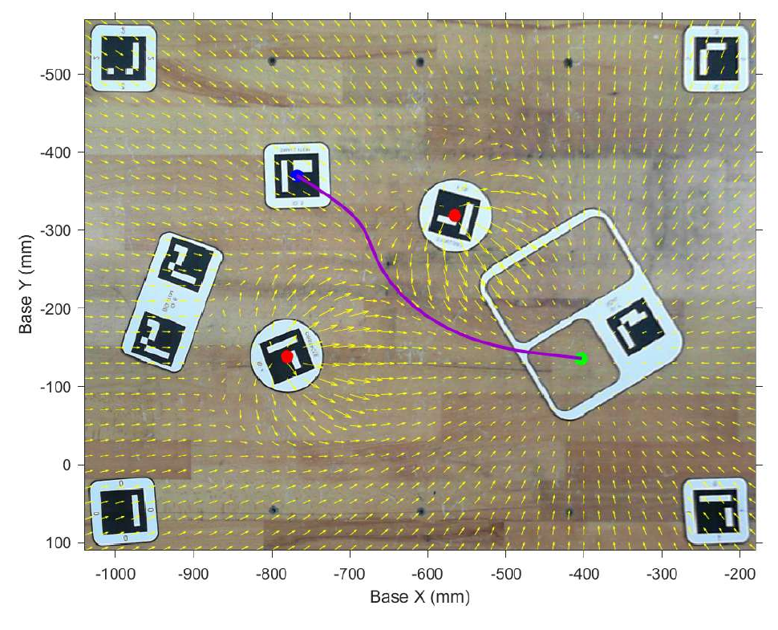
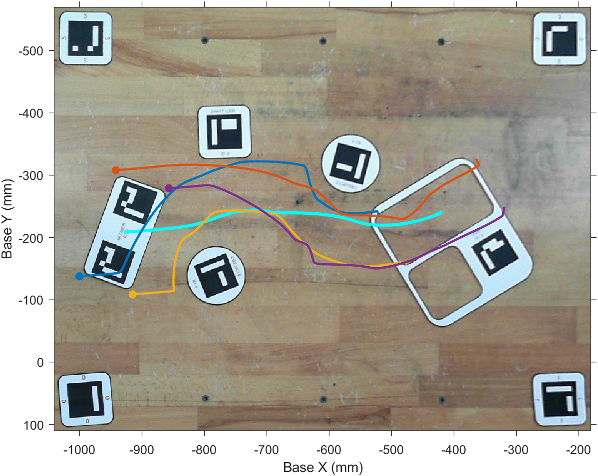
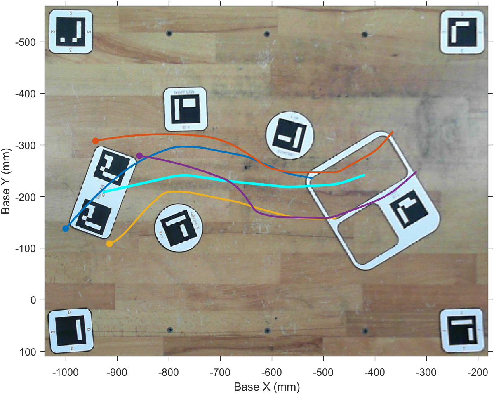

# UR5e 视觉引导拾放系统

本仓库分阶段整理一个基于 MATLAB 的 UR5e 视觉引导拾放系统。当前版本实现
平面场景定位、小物体人工势场路径规划、大物体 APF 与 A* 位姿规划，以及
高架槽口定位和倾斜插入：首先从单张相机图像检测 ArUco markers，利用工作台
reference markers 建立图像到机器人 Base 平面的 Homography，再根据物体、
目标和障碍物位姿生成二维或 SE(2) 路径。小物体和大物体共享同一套平面拾放
动作生成与 RTDE 执行接口；对于高于桌面的 ID8，系统进一步利用已知相机光心
和 marker 高度沿相机射线修正其 Base XYZ，并将安全 A* 路径转换为可独立检查
的拾取、运输、倾斜、插入和撤离动作程序。

## ArUco 平面场景定位

### 1. Marker 检测与场景角色

主函数使用 `DICT_ARUCO_ORIGINAL` 字典检测 marker，并保留原始 ID、图像角点
和检测到的 family。当前场景要求 ID0 至 ID7 均可见，各 ID 的作用如下：

| Marker ID | 场景作用 | 实例规则 |
|---:|---|---|
| 0、1、2、3 | 图像与 Base 平面的 reference markers | 缺失时报错；重复时选择图像面积最大的实例 |
| 4 | 圆形障碍物中心 | 允许多个并全部保留 |
| 5 | 小物体位姿 | 必须且只能有一个 |
| 6 | 大物体上的定位 markers | 允许多个并全部保留 |
| 7 | 平面目标板位姿 | 必须且只能有一个 |

如果缺失任意必需 ID，函数会停止定位并给出明确错误。对于 reference marker
的重复检测，代码计算每个候选 polygon 的图像面积并选择最大实例，从而处理
远处误检或同一 ID 出现多个候选框的情况。

检测结果还可通过绿色边框、红色角点和 ID 标签绘制到
`scene.annotatedImage`，用于检查 marker 顺序和检测质量。

### 2. Projective marker center

设 marker 的四个图像角点为齐次坐标

$$
\tilde{\boldsymbol p}_i=
\begin{bmatrix}
u_i & v_i & 1
\end{bmatrix}^{\mathsf T},
\qquad i=1,\ldots,4.
$$

两条对角线分别为

$$
\boldsymbol l_{13}
=\tilde{\boldsymbol p}_1\times\tilde{\boldsymbol p}_3,
\qquad
\boldsymbol l_{24}
=\tilde{\boldsymbol p}_2\times\tilde{\boldsymbol p}_4.
$$

marker 中心由两条对角线的交点得到：

$$
\tilde{\boldsymbol c}
=\boldsymbol l_{13}\times\boldsymbol l_{24},
\qquad
\boldsymbol c=
\frac{1}{\tilde c_3}
\begin{bmatrix}
\tilde c_1 & \tilde c_2
\end{bmatrix}.
$$

该实现保留了 projective transformation 下的对角线交点，不直接对四个像素
角点取算术平均。若两条对角线退化、无法得到有限交点，函数会抛出错误。

### 3. 图像坐标到 Base 坐标的 Homography

ID0 至 ID3 的 marker center 提供四组图像平面与机器人 Base 平面的对应点。
代码使用以下固定 Base 坐标，单位为 millimetre：

| Reference ID | Base X (mm) | Base Y (mm) |
|---:|---:|---:|
| 1 | -230 | 60 |
| 3 | -230 | -520 |
| 0 | -990 | 60 |
| 2 | -990 | -520 |

对于图像点 $[u,v]$ 和 Base 平面点 $[x_B,y_B]$，projective
transformation 满足

$$
s
\begin{bmatrix}
x_B\\
y_B\\
1
\end{bmatrix}
=
H
\begin{bmatrix}
u\\
v\\
1
\end{bmatrix},
$$

其中 $H$ 为 $3\times3$ Homography matrix，$s$ 为非零尺度因子。估计出的
变换保存在 `scene.imageToBaseTransform` 中。

原始图像同时被投影到固定 Base 工作区：

| 参数 | 数值 |
|---|---:|
| 输出图像尺寸 | `680 x 860` |
| Base X 范围 | `[-1040, -180] mm` |
| Base Y 范围 | `[-570, 110] mm` |

变换后的俯视图和空间参考分别保存在 `scene.boardImage` 和
`scene.boardReference` 中。

### 4. Base 平面二维位姿

对任意 marker，首先使用 Homography 将四个角点转换到 Base 平面：

$$
\boldsymbol P_i=h(\boldsymbol p_i),
\qquad i=1,\ldots,4.
$$

Base 平面位置仍由两条对角线的交点确定。marker 的局部 $+X$ 轴定义为
$P_1\rightarrow P_2$，因此平面朝向为

$$
\theta=
\operatorname{atan2}
\left(P_{2,y}-P_{1,y},\;P_{2,x}-P_{1,x}\right).
$$

每组 marker pose 使用相同字段：

| 字段 | 形状 | 含义 |
|---|---:|---|
| `position` | `N x 2` | Base 平面位置，单位为 mm |
| `theta` | `N x 1` | 从 Base X 轴到 marker X 轴的角度，单位为 rad |
| `corners` | `4 x 2 x N` | 四个 Base 平面角点，单位为 mm |

### 5. 大物体位姿组合

大物体由所有 ID6 marker 的检测结果组合。其中心位置采用全部 ID6 中心的
平均值：

$$
\boldsymbol T_{\mathrm{big}}
=\frac{1}{N_6}\sum_{k=1}^{N_6}\boldsymbol T_{6,k}.
$$

为保持与当前机器人任务实现一致，大物体朝向使用第一个 ID6 marker 的朝向：

$$
\theta_{\mathrm{big}}=\theta_{6,1}.
$$

`scene.bigItem.corners` 保存参与该估计的全部 ID6 marker 角点，而不是
180-by-90 mm 大物体的实体边界；实体几何模型属于后续大物体路径规划模块。

### 6. Marker 局部 offset 到 Base 坐标

二维旋转矩阵定义为

$$
R(\theta)=
\begin{bmatrix}
\cos\theta & -\sin\theta\\
\sin\theta &  \cos\theta
\end{bmatrix}.
$$

在 ID7 局部坐标系中定义的 offset 通过下式转换到 Base 坐标：

$$
\boldsymbol d_B=R(\theta_7)\boldsymbol d_{\mathrm{local}},
\qquad
\boldsymbol T_{\mathrm{goal}}=
\boldsymbol T_7+\boldsymbol d_B.
$$

当前使用两个固定目标 offset：

$$
\boldsymbol d_{\mathrm{small}}=
\begin{bmatrix}-80 & 0\end{bmatrix}^{\mathsf T}\ \mathrm{mm},
\qquad
\boldsymbol d_{\mathrm{big}}=
\begin{bmatrix}-40 & -100\end{bmatrix}^{\mathsf T}\ \mathrm{mm}.
$$

两个目标的朝向均等于 ID7 的朝向。`smallGoal.corners` 和
`bigGoal.corners` 保存用于推导目标的 ID7 marker 角点，不表示目标区域的
实体边界。

## 小物体人工势场路径规划

### 1. 场景输入与参数

规划器直接使用视觉定位结果，不重新解析 marker：

| 规划输入 | `scene` 来源 | 含义 |
|---|---|---|
| 起点 $\boldsymbol p_0$ | `smallItem.position` | 小物体中心的 Base XY 坐标 |
| 目标 $\boldsymbol g$ | `smallGoal.position` | 由 ID7 和局部 offset 得到的目标点 |
| 障碍物 $\boldsymbol o_i$ | `obstacles.position` | 全部 ID4 marker 中心 |
| 工作区范围 | `boardReference` | 势场采样和路径边界诊断使用的 Base XY 范围 |

当前规划参数如下，距离单位均为 mm：

| 参数 | 数值 | 含义 |
|---|---:|---|
| `gridSpacing` | 20 | 势场可视化网格间距 |
| `step` | 5 | 每次迭代的目标位移长度 |
| `maximumIterations` | 1000 | 最大路径迭代次数 |
| `smoothingFactor` | 0.4 | 相邻位移的低通平滑系数 |
| `attractionSwitchDistance` | 190 | 吸引力分段切换距离 |
| `attractiveGain` | 2 | 吸引力增益 |
| `repulsionInfluenceDistance` | 200 | 障碍物排斥作用范围 |
| `repulsiveGain` | $9\times10^8$ | 排斥力增益 |
| `maximumRepulsion` | 550 | 单个障碍物的排斥力上限 |

### 2. 分段吸引力

对当前位置 $\boldsymbol p$，定义目标方向差和目标距离为

$$
\boldsymbol r=\boldsymbol p-\boldsymbol g,
\qquad d=\|\boldsymbol r\|.
$$

吸引力在目标附近采用线性形式，在远处限制为常幅值，避免其随距离无限增大：

$$
\boldsymbol F_{\mathrm{att}}(\boldsymbol p)=
\begin{cases}
-k_a\boldsymbol r, & d\le d_a,\\[4pt]
-k_a d_a\dfrac{\boldsymbol r}{d}, & d>d_a,
\end{cases}
$$

其中 $k_a=2$，$d_a=190\ \mathrm{mm}$。

### 3. 有限作用范围排斥力

对第 $i$ 个障碍物，令

$$
\boldsymbol q_i=\boldsymbol p-\boldsymbol o_i,
\qquad \rho_i=\|\boldsymbol q_i\|.
$$

当当前位置进入影响距离 $\rho_0=200\ \mathrm{mm}$ 时，该障碍物产生排斥力：

$$
\boldsymbol F_{\mathrm{rep},i}(\boldsymbol p)=
\begin{cases}
\min\!\left[
\eta\left(\dfrac{1}{\rho_i}-\dfrac{1}{\rho_0}\right)
\dfrac{1}{\rho_i^2},\ F_{\max}
\right]
\dfrac{\boldsymbol q_i}{\rho_i},
& 0<\rho_i<\rho_0,\\[8pt]
\boldsymbol 0, & \rho_i\ge\rho_0,
\end{cases}
$$

其中 $\eta=9\times10^8$，$F_{\max}=550$。当 $\rho_i\le10^{-9}$ mm 时，
排斥方向没有唯一解，当前实现返回零向量。总作用力为

$$
\boldsymbol F(\boldsymbol p)=
\boldsymbol F_{\mathrm{att}}(\boldsymbol p)
+\sum_i\boldsymbol F_{\mathrm{rep},i}(\boldsymbol p).
$$

`sample_apf_vector_field` 在整个工作区以 20 mm 间距计算该合力，输出
`X/Y/U/V` 矩阵供 `quiver` 等函数可视化。路径迭代则在当前位置直接计算
合力，不受可视化网格分辨率限制。

### 4. 平滑路径迭代与终止条件

设固定目标步长为 $s=5\ \mathrm{mm}$，首先沿总作用力方向计算目标位移：

$$
\Delta\boldsymbol p_k^{*}
=s\frac{\boldsymbol F(\boldsymbol p_k)}
{\|\boldsymbol F(\boldsymbol p_k)\|}.
$$

为降低相邻路径段的方向突变，实际位移使用一阶递推平滑：

$$
\Delta\boldsymbol p_k
=\alpha\Delta\boldsymbol p_{k-1}
+(1-\alpha)\Delta\boldsymbol p_k^{*},
\qquad
\boldsymbol p_{k+1}=\boldsymbol p_k+\Delta\boldsymbol p_k,
$$

其中 $\alpha=0.4$，初始位移为零。该递推使路径段长度不超过 5 mm。当路径
进入目标点 5 mm 邻域时，规划器将最后一点精确设置为目标。规划结果只使用
以下三种停止状态：

| `stopReason` | 含义 |
|---|---|
| `"goal_reached"` | 已进入目标邻域，并将终点精确设置为目标 |
| `"zero_force"` | 总作用力低于容差，无法确定继续移动的方向 |
| `"iteration_limit"` | 达到 1000 次迭代但尚未到达目标 |

`minimumObstacleDistance` 统计整条中心路径到所有 ID4 中心的最小欧氏距离。
它用于比较不同规划结果，不包含小物体尺寸、障碍物半径、机械臂几何或安全
裕量，因此不能单独视为实体碰撞安全证明。

### 5. 规划结果示例

下图使用一个本地离线场景展示图像定位、势场采样和路径规划的组合结果。
黄色箭头表示采样势场方向（显示时由 `quiver` 自动缩放），紫色曲线为规划
路径，蓝色点为小物体起点，绿色点为目标位置，红色点为障碍物中心。

<p align="center">
  
  <br>小物体人工势场与中心路径规划结果
</p>

## 大物体 SE(2) 位姿规划

### 1. 实体模型与路径状态

大物体不仅需要移动中心，还需要在避障过程中连续调整平面朝向。规划状态统一
表示为

$$
\boldsymbol q=
\begin{bmatrix}x & y & \theta\end{bmatrix},
$$

其中 $[x,y]$ 为 Base 平面中心位置，$\theta$ 为大物体朝向。规划器使用
`180 x 90 mm` 的矩形模型，其四个局部角点为

$$
\boldsymbol c_j^{\mathrm{local}}\in
\left\{
(-90,-45),(90,-45),(-90,45),(90,45)
\right\}.
$$

给定位姿 $\boldsymbol q$，第 $j$ 个角点在 Base 坐标系中的位置为

$$
\boldsymbol c_j(\boldsymbol q)
=
\begin{bmatrix}x\\y\end{bmatrix}
+R(\theta)\boldsymbol c_j^{\mathrm{local}}.
$$

共享路径评估器以不超过 `2.5 mm / 1.5 degree` 的间隔插值检查路径。每个检查
位姿要求四个角点均位于工作区，并计算以下 clearance 指标：

$$
d_{\mathrm{center}}>100\ \mathrm{mm},
\qquad
d_{\mathrm{corner}}>70\ \mathrm{mm}.
$$

该检查使用一个中心点和四个角点组成的五点模型，没有计算矩形边与圆形障碍物
之间的连续几何距离，也没有包含机械臂连杆或三维扫掠体。

### 2. APF 位姿规划

APF 规划器保留已验证的中心力、角点力和避障力矩递推。中心吸引力和中心
排斥力组成

$$
\boldsymbol F_{\mathrm{center}}
=\boldsymbol F_{\mathrm{att}}(\boldsymbol p)
+\boldsymbol F_{\mathrm{rep}}(\boldsymbol p),
$$

四个角点分别计算有限作用范围排斥力
$\boldsymbol F_{\mathrm{corner},j}$。平移合力使用四角排斥力的平均值：

$$
\boldsymbol F_{\mathrm{total}}
=\boldsymbol F_{\mathrm{center}}
+\frac{1}{4}\sum_{j=1}^{4}
\boldsymbol F_{\mathrm{corner},j}.
$$

设角点相对中心的力臂为
$\boldsymbol r_j=\boldsymbol c_j-\boldsymbol p$，二维叉积产生避障力矩：

$$
\tau_{\mathrm{rep}}
=\sum_{j=1}^{4}
\left(r_{j,x}F_{j,y}-r_{j,y}F_{j,x}\right).
$$

当中心进入目标 `100 mm` 范围后，目标朝向力矩按距离线性增加：

$$
\tau_{\mathrm{goal}}
=w(d)k_\theta\,
\operatorname{clip}(\theta_g-\theta,-\pi,\pi),
\qquad
w(d)=\operatorname{clip}\left(1-\frac{d}{100},0,1\right).
$$

最终力矩为 $\tau_{\mathrm{rep}}+\tau_{\mathrm{goal}}$。平移和旋转增量分别使用
0.5 的一阶滤波；正常迭代的最大平移步长为 5 mm，最大角度步长为 3 degree。
进入 5 mm 目标邻域后，规划器精确写入目标位置和朝向，因此最后一个目标
对齐点不受 3 degree 迭代上限约束。规划状态只使用 `goal_reached`、
`zero_motion` 和 `iteration_limit`。

`clearanceSafe` 在 APF 完成后统一计算，只用于诊断和方法比较，不会改变 APF
递推、阻止输出或自动重新规划。因此 APF 到达目标并不等同于满足 A* 使用的
`100/70 mm` 硬 clearance 条件。

### 3. SE(2) A* 搜索

A* 在 `5 mm x 5 mm x 3 degree` 的离散 SE(2) 网格中使用 26 邻域搜索。
起点作为网格锚点保留精确位姿，目标则作为经过完整边验证的虚拟节点连接到
搜索图。为统一平移与旋转代价，使用矩形中心到角点的距离

$$
r_c=\operatorname{hypot}(90,45)
$$

将角度变化转换为角点等效位移。相邻状态的运动代价为

$$
c(\boldsymbol q_i,\boldsymbol q_{i+1})
=\operatorname{hypot}
\left(
\|\Delta\boldsymbol p\|,
r_c|\Delta\theta|
\right),
$$

启发函数采用当前位置到目标的同形式下界。每条搜索边都按
`2.5 mm / 1.5 degree` 插值，并在每个插值位姿验证工作区、中心距离和四角
距离。搜索采用自定义二叉最小堆管理 open set，并通过连续角度展开避免
$-\pi$ 与 $\pi$ 边界造成不必要的朝向跳变。

### 4. 安全路径平滑

离散 A* 路径依次经过以下处理：

1. 贪心 shortcut 删除可以被安全直连的中间节点；
2. 使用二次 Bezier 曲线对局部拐角进行圆角化；
3. 若圆角不安全，最多进行 6 次自适应缩小；
4. 按最大 5 mm 平移和 3 degree 角度间隔重新采样。

每个 shortcut、Bezier 片段和最终重采样路径都重新执行五点检查。如果某个
圆角无法保持安全，则退回已经验证的路径，而不是输出未经检查的平滑结果。

### 5. APF 与 A* 轨迹对比

下图使用同一个本地离线场景展示两种规划方法。青色曲线为大物体中心轨迹，
另外四种颜色分别表示四个实体角点随位姿变化形成的轨迹；彩色圆点标记四个
角点的起始位置。

<table>
  <tr>
    <td align="center" width="50%">
      <br>
      APF 位姿规划
    </td>
    <td align="center" width="50%">
      <br>
      SE(2) A* 搜索与安全平滑
    </td>
  </tr>
</table>

## 通用平面拾放动作生成与执行

小物体和大物体使用相同的机械动作顺序，差别只在规划路径是否包含逐点朝向。
通用动作生成器直接接收起点 pose、目标 pose 和规划结果：

```matlab
smallProgram = build_planar_pick_place_program( ...
    scene.smallItem, scene.smallGoal, smallPlan);

largeProgram = build_planar_pick_place_program( ...
    scene.bigItem, scene.bigGoal, largePlan);
```

### 1. 二维路径与位姿路径

| 路径格式 | 运输阶段 TCP 朝向 | 放置前处理 |
|---|---|---|
| `N x 2 [x,y]` | 保持起点物体 yaw | 在目标上方旋转到目标 yaw |
| `N x 3 [x,y,theta]` | 每个 waypoint 使用对应 theta | 若末点已是目标 pose，则跳过重复对齐 |

两种路径都从第二个路径点开始生成运输 waypoint。每个 waypoint 为
`[x,y,z,rx,ry,rz,a,v,t,blend]`，最后一个 waypoint 的 blend 强制设为零。
工具姿态始终由平面 theta 转换为吸盘朝向 Base `-Z` 的 UR 旋转向量。

动作生成器要求路径以 `goal_reached` 结束、全部路径点位于工作区，并检查路径
位置是否匹配传入的起终点。对于 `N x 3` 路径，还会使用最短角度差检查起终点
theta。规划结果中的 `clearanceSafe` 若存在，只作为规划诊断保留，不改变原实机
流程的执行语义。

### 2. 动作程序

统一返回的 `program` 字段为：

| 字段 | 含义 |
|---|---|
| `prePickPose` | 起点上方的预吸取位姿 |
| `pickPose` | `Z=6 mm` 的吸取位姿 |
| `liftPose` | 吸取后抬升到 `Z=12 mm` 的位姿 |
| `transportWaypoints` | 从路径第二点开始生成的 `N x 10` 运输 waypoint |
| `prePlacePose` | 目标上方、完成目标 yaw 对齐的位姿 |
| `placePose` | `Z=6 mm` 的放置位姿 |
| `retreatPose` | 释放后回到目标上方的撤离位姿 |
| `homePose` | 固定机器人 home pose |
| `parameters` | 高度、速度、blend、等待和数值容差参数 |

固定运动参数保持原集成实机代码：

| 参数 | 数值 |
|---|---:|
| 吸取/放置高度 | `6 mm` |
| 运输高度 offset | `6 mm` |
| 运输高度 | `12 mm` |
| `movej` / `movel` acceleration | `1` |
| `movej` / `movel` velocity | `0.6` |
| time | `0` |
| 中间 waypoint blend | `0.001 m` |
| 普通动作等待 | `0.1 s` |
| 吸取/释放等待 | `0.5 s` |

### 3. RTDE 与真空吸盘执行

```matlab
execute_planar_pick_place(rtde, vacuum, smallProgram);
execute_planar_pick_place(rtde, vacuum, largeProgram);
```

完整动作顺序为：

1. `movej` 到预吸取位姿；
2. `movel` 下降并启动真空吸盘；
3. `movel` 抬升后使用 `movej` 执行规划 waypoint；
4. 必要时使用 `movel` 完成目标 yaw 对齐；
5. `movel` 下降放置并释放物体；
6. `movel` 撤离，最后 `movej` 返回 home pose。

执行器会分别处理零、单和多个运输 waypoint，并跳过已经到位的重复目标对齐。
函数不建立网络连接、不保存机器人 IP，也不捕获或掩盖底层硬件错误。由于
waypoint 使用 `movej`，相邻目标之间采用关节空间插值，不能据此声称 TCP 严格
沿规划器输出的二维或 SE(2) 线段运动。

## 高架槽口定位与倾斜插入

### 1. Homography 的平面限制

工作台 Homography 由位于桌面平面 `Z=0` 的 ID0 至 ID3 建立，因此它只能将
图像点映射为对应相机射线与桌面的交点。若直接将同一个 Homography 用于高于
桌面的 ID8，得到的 Base XY 实际是 ID8 角点在 `Z=0` 上的射线投影，而不是
marker 的真实平面位置。

设相机光心在 Base 坐标系中的已知位置为

$$
\boldsymbol C=
\begin{bmatrix}-1300 & -60 & 860\end{bmatrix}^{\mathsf T} \mathrm{mm},
$$

桌面 Homography 给出的角点为
$\boldsymbol P_0=[P_{0,x},P_{0,y},0]^{\mathsf T}$，ID8 所在平面的已知高度为
$h=90\ \mathrm{mm}$。同一条相机射线可以写为

$$
\boldsymbol P(t)=\boldsymbol C+t(\boldsymbol P_0-\boldsymbol C).
$$

令其 Z 分量等于 $h$，可得

$$
\lambda=\frac{C_z-h}{C_z},
\qquad
\boldsymbol P_h^{xy}
=\boldsymbol C^{xy}
+\lambda\left(\boldsymbol P_0^{xy}-\boldsymbol C^{xy}\right).
$$

代码对 ID8 的四个图像角点分别执行该修正，再使用两条对角线的 projective
交点计算 marker 中心。因为四个 XY 角点都经过相同的正比例缩放和平移，
`P1` 到 `P2` 定义的平面朝向保持不变。

该方法解决的是两个已知、平行高度平面之间的射线交点修正。它依赖已知相机
光心、已知 ID8 高度以及桌面与 marker 平面平行的假设，不等同于完整相机标定，
也不能用于任意六自由度三维位姿重建。

### 2. 槽入口位姿

ID8 修正后的位姿表示为

$$
\boldsymbol T_8=
\begin{bmatrix}x_8 & y_8 & 90\end{bmatrix},
\qquad \theta_8=\operatorname{atan2}(P_{2,y}-P_{1,y},P_{2,x}-P_{1,x}).
$$

槽入口在 ID8 局部平面内使用固定 offset
$\boldsymbol d_{\mathrm{slot}}=[0,-80]^{\mathsf T}\ \mathrm{mm}$，其 Base
位置和朝向为

$$
\boldsymbol T_{\mathrm{slot}}^{xy}
=\boldsymbol T_8^{xy}+R(\theta_8)\boldsymbol d_{\mathrm{slot}},
\qquad
T_{\mathrm{slot},z}=60\ \mathrm{mm},
\qquad
\theta_{\mathrm{slot}}=\theta_8.
$$

`scene.elevatedMarker.corners` 保存修正到 `Z=90 mm` 的四个 ID8 角点；
`scene.slotEntrance.corners` 保留同一组来源角点，用于追溯槽入口的视觉依据，
并不表示槽口的实体碰撞边界。

### 3. A* 平面运输

倾斜和插入之前，小物体先在桌面上方以固定运输高度移动到槽入口 XY。规划器
使用与小物体实体近似相匹配的二维 A*：

| 参数 | 数值 |
|---|---:|
| XY 网格分辨率 | `5 mm` |
| 邻域 | 8 邻域 |
| 小物体圆形近似半径 | `65 mm` |
| 障碍物圆形近似半径 | `50 mm` |
| 严格最小中心距离 | `>115 mm` |
| 搜索边检查间隔 | `<=2.5 mm` |
| 平滑输出最大步长 | `5 mm` |

搜索网格锚定精确起点，目标作为经过连续边验证的虚拟节点。原始路径依次经过
贪心 shortcut、二次 Bezier 圆角、最多 6 次自适应缩小和 5 mm 重采样；任何
不满足工作区或 clearance 的圆角都会退回已经验证的路径。规划结果只使用
`goal_reached` 和 `no_path` 两种停止状态。

动作生成器只接受成功、位于收缩工作区且 `clearanceSafe=true` 的 A* 计划，
并再次检查路径起终点是否分别匹配小物体和槽入口。该 clearance 只覆盖平面
运输阶段的圆形近似，不包含 UR5e 连杆或插入过程中的三维扫掠体。

### 4. 局部坐标倾斜与插入

到达槽入口 XY 上方后，TCP 首先保持吸盘向下并对齐槽口 yaw。随后在当前 TCP
局部 X 轴上右乘 `+45 degree` 旋转：

$$
R_{\mathrm{tilt}}
=R_{\mathrm{downward}}(\theta_{\mathrm{slot}})R_x(45^\circ).
$$

接近、插入和撤离位移都在倾斜后的 TCP 局部 Z 轴中定义，再转换到 Base 坐标：

$$
\Delta\boldsymbol p_{\mathrm{clear}}
=R_{\mathrm{tilt}}
\begin{bmatrix}0\\0\\-40\end{bmatrix},
\quad
\Delta\boldsymbol p_{\mathrm{insert}}
=R_{\mathrm{tilt}}
\begin{bmatrix}0\\0\\50\end{bmatrix},
\quad
\Delta\boldsymbol p_{\mathrm{retreat}}
=R_{\mathrm{tilt}}
\begin{bmatrix}0\\0\\-50\end{bmatrix}.
$$

完整执行顺序为：

1. `movej` 到预吸取位姿；
2. `movel` 下降至 `6 mm` 吸取高度并启动真空吸盘；
3. `movel` 抬升到 `156 mm` 运输高度；
4. `movej` 执行 A* waypoint；
5. `movel` 对齐槽口 yaw，再完成倾斜和局部 `-40 mm` 后移；
6. `movel` 到达槽入口、沿局部 Z 轴插入 `50 mm` 并释放物体；
7. 沿局部 Z 轴撤离 `50 mm`，最后 `movej` 返回 home pose。

运动参数为 `a=1`、`v=0.6`、`t=0`，中间 waypoint 的 blend radius 为
`0.001 m`，最后一个 waypoint 强制为零。普通动作后等待 `0.1 s`，吸取和
释放后分别等待 `0.5 s`。动作生成函数只构造 TCP pose 和 waypoint；硬件
执行函数接收调用方已经建立的 RTDE 和 vacuum 对象，不保存 IP、不创建连接，
也不捕获或掩盖硬件错误。

## 代码结构

| 文件 | 作用 |
|---|---|
| [`localize_pick_place_scene.m`](src/localize_pick_place_scene.m) | 平面场景定位主入口；组织检测、验证、Homography、位姿和目标计算 |
| [`pick_place_scene_config.m`](src/pick_place_scene_config.m) | 保存 marker family、Base reference、工作区和目标 offset |
| [`validate_aruco_detections.m`](src/validate_aruco_detections.m) | 检查必需 ID、重复规则并选择 reference marker |
| [`aruco_marker_center.m`](src/aruco_marker_center.m) | 使用齐次直线交点计算 projective marker center |
| [`estimate_board_homography.m`](src/estimate_board_homography.m) | 估计图像坐标到 Base 平面坐标的 projective transformation |
| [`aruco_marker_pose_2d.m`](src/aruco_marker_pose_2d.m) | 计算指定 ID 的 Base 平面位置、朝向和角点 |
| [`annotate_aruco_markers.m`](src/annotate_aruco_markers.m) | 在图像中标注 marker 边框、角点、中心和 ID |
| [`rotation_matrix_2d.m`](src/rotation_matrix_2d.m) | 构造二维旋转矩阵 |
| [`transform_local_offset_2d.m`](src/transform_local_offset_2d.m) | 将 marker 局部 offset 转换到 Base 坐标系 |
| [`downward_tcp_rotation.m`](src/downward_tcp_rotation.m) | 将 Base 平面 theta 转换为吸盘向下的 UR 旋转向量 |
| [`planar_pick_place_config.m`](src/planar_pick_place_config.m) | 保存通用平面拾放高度、速度、等待和容差参数 |
| [`build_planar_pick_place_program.m`](src/build_planar_pick_place_program.m) | 将 `N x 2` 或 `N x 3` 路径转换为统一拾放动作程序 |
| [`execute_planar_pick_place.m`](src/execute_planar_pick_place.m) | 使用调用方提供的 RTDE/vacuum 对象执行平面拾放程序 |
| [`plan_small_item_apf.m`](src/plan_small_item_apf.m) | 小物体 APF 规划主入口；生成路径、势场和诊断信息 |
| [`small_item_apf_config.m`](src/small_item_apf_config.m) | 保存势场、步长、平滑和停止参数 |
| [`apf_attractive_force.m`](src/apf_attractive_force.m) | 计算分段目标吸引力 |
| [`apf_repulsive_force.m`](src/apf_repulsive_force.m) | 累加有限作用范围内的障碍物排斥力 |
| [`apf_total_force.m`](src/apf_total_force.m) | 组合目标吸引力和障碍物排斥力 |
| [`sample_apf_vector_field.m`](src/sample_apf_vector_field.m) | 在 Base 工作区网格上采样 APF 向量场 |
| [`plan_large_item_apf.m`](src/plan_large_item_apf.m) | 使用中心力、角点力和避障力矩规划大物体 SE(2) 路径 |
| [`plan_large_item_astar.m`](src/plan_large_item_astar.m) | 组织大物体 A* 搜索、路径平滑和统一诊断输出 |
| [`search_large_item_astar.m`](src/search_large_item_astar.m) | 在 SE(2) 网格中执行 26 邻域 A* 搜索和边验证 |
| [`smooth_large_item_astar_path.m`](src/smooth_large_item_astar_path.m) | 执行 shortcut、Bezier 圆角、安全回退和重新采样 |
| [`large_item_planning_config.m`](src/large_item_planning_config.m) | 保存实体几何、clearance、APF、A* 和平滑参数 |
| [`large_item_corners.m`](src/large_item_corners.m) | 根据中心位姿计算 180 x 90 mm 矩形的四个 Base 角点 |
| [`large_item_scene_inputs.m`](src/large_item_scene_inputs.m) | 从视觉场景提取并验证大物体规划输入 |
| [`evaluate_large_item_path.m`](src/evaluate_large_item_path.m) | 插值评估工作区、中心/角点 clearance 和运动指标 |
| [`tilted_insertion_scene_config.m`](src/tilted_insertion_scene_config.m) | 保存 ID8、相机光心、已知高度、槽入口和工作区参数 |
| [`project_marker_to_elevated_plane.m`](src/project_marker_to_elevated_plane.m) | 沿相机射线将桌面投影修正到已知高度平面 |
| [`elevated_aruco_marker_pose.m`](src/elevated_aruco_marker_pose.m) | 从修正后的 ID8 角点计算 Base XYZ 和平面朝向 |
| [`localize_tilted_insertion_scene.m`](src/localize_tilted_insertion_scene.m) | 组织倾斜插入场景的检测、Homography、高度修正和槽入口定位 |
| [`small_item_astar_config.m`](src/small_item_astar_config.m) | 保存小物体 A*、圆形 clearance、边检查和平滑参数 |
| [`search_small_item_astar.m`](src/search_small_item_astar.m) | 执行锚定精确起点和虚拟目标连接的二维 A* 搜索 |
| [`smooth_small_item_astar_path.m`](src/smooth_small_item_astar_path.m) | 执行 shortcut、Bezier 圆角、重采样和安全回退 |
| [`evaluate_small_item_path.m`](src/evaluate_small_item_path.m) | 插值评估小物体路径的工作区、clearance 和运动指标 |
| [`plan_insertion_transport_astar.m`](src/plan_insertion_transport_astar.m) | 规划小物体到槽入口的安全 A* 平面运输路径 |
| [`tilted_insertion_motion_config.m`](src/tilted_insertion_motion_config.m) | 保存吸取、运输、倾角、局部位移和 RTDE 运动参数 |
| [`rotate_tcp_about_local_x.m`](src/rotate_tcp_about_local_x.m) | 绕当前 TCP 局部 X 轴右乘旋转并返回 UR 旋转向量 |
| [`build_tilted_insertion_program.m`](src/build_tilted_insertion_program.m) | 将 A* 路径转换为拾取、倾斜、插入和撤离动作程序 |
| [`execute_tilted_insertion.m`](src/execute_tilted_insertion.m) | 使用调用方提供的 RTDE/vacuum 对象执行动作程序 |

## 视觉定位接口说明

```matlab
scene = localize_pick_place_scene(image)
```

### 输入

- `image`：非空、有限的二维灰度图像或三通道 RGB 图像；支持 MATLAB
  数值类型和 logical 类型。
- 函数本身不打开 webcam，也不建立机器人或真空吸盘连接。

### 输出

| `scene` 字段 | 含义 |
|---|---|
| `markerIDs` | `readArucoMarker` 返回的原始 marker IDs |
| `markerCorners` | 原始图像角点，形状为 `4 x 2 x N` |
| `detectedFamily` | 检测到的 ArUco family |
| `imageToBaseTransform` | 图像坐标到 Base 平面的 projective transformation |
| `annotatedImage` | 带 marker 边框、角点和 ID 的检测图像 |
| `boardImage` | 投影到固定 Base 工作区的俯视图 |
| `boardReference` | `boardImage` 对应的空间参考对象 |
| `obstacles` | 全部 ID4 marker poses |
| `smallItem` | ID5 marker pose |
| `bigMarkers` | 全部 ID6 marker poses |
| `bigItem` | ID6 聚合得到的大物体位姿 |
| `targetBoard` | ID7 marker pose |
| `smallGoal` | ID7 加小目标 offset 后的位姿 |
| `bigGoal` | ID7 加大目标 offset 后的位姿 |
| `referenceImagePoints` | 实际用于 Homography 的四个图像中心点 |
| `referenceWorldPoints` | 与图像中心点对应的 Base 坐标 |

无效图像、缺失 marker、重复 ID5/ID7、退化 marker 几何或 Homography
估计失败都会产生带稳定 identifier 的明确错误，而不是返回部分场景结果。

## 小物体路径规划接口说明

```matlab
plan = plan_small_item_apf(scene)
```

输入 `scene` 应由 `localize_pick_place_scene` 生成。规划器检查小物体、目标、
障碍物和工作区字段，并拒绝非有限坐标或无效边界。

| `plan` 字段 | 含义 |
|---|---|
| `path` | `N x 2` 中心路径，Base XY 坐标，单位为 mm |
| `field.X`, `field.Y` | 势场采样点的 Base XY 网格 |
| `field.U`, `field.V` | 每个网格点的总作用力分量 |
| `reachedGoal` | 是否成功进入目标邻域 |
| `stopReason` | `goal_reached`、`zero_force` 或 `iteration_limit` |
| `iterations` | 实际执行的 APF 位移迭代次数 |
| `endpointError` | 最后一个路径点到目标的欧氏距离，单位为 mm |
| `insideBoard` | 全部路径点是否位于工作区 XY 范围内 |
| `minimumObstacleDistance` | 路径中心到最近 ID4 中心的距离，单位为 mm |
| `meanStep` | 相邻路径点的平均距离，单位为 mm |
| `maximumStep` | 相邻路径点的最大距离，单位为 mm |
| `maximumTurnDeg` | 相邻非零路径段之间的最大转角，单位为 degree |
| `parameters` | 本次规划使用的完整 APF 参数结构体 |

## 大物体路径规划接口说明

```matlab
apfPlan = plan_large_item_apf(scene)
astarPlan = plan_large_item_astar(scene)
```

两个规划器直接读取 `scene.bigItem`、`scene.bigGoal`、`scene.obstacles` 和
`scene.boardReference`，并统一返回 `N x 3` 的 Base 平面位姿路径：

| 公共字段 | 含义 |
|---|---|
| `method` | 规划方法标识：`apf` 或 `astar` |
| `path` | `N x 3` 的 `[x,y,theta]` 路径，单位为 mm、mm、rad |
| `reachedGoal` | 是否成功连接到精确目标位姿 |
| `stopReason` | APF：`goal_reached`、`zero_motion`、`iteration_limit`；A*：`goal_reached`、`no_path` |
| `endpointPositionError` | 最后一个位姿到目标位置的欧氏距离，单位为 mm |
| `endpointThetaErrorDeg` | 使用最短角度差计算的终点朝向误差，单位为 degree |
| `insideBoard` | 插值后的中心和四角是否全部位于工作区 |
| `clearanceSafe` | 是否严格满足中心 `>100 mm`、角点 `>70 mm` 的五点条件 |
| `minimumCenterDistance` | 插值中心路径到最近障碍物中心的距离，单位为 mm |
| `minimumCornerDistance` | 插值四角路径到最近障碍物中心的距离，单位为 mm |
| `pathLength` | 中心平移路径总长度，单位为 mm |
| `combinedMotionCost` | 使用角点半径统一平移和旋转后的累计运动代价 |
| `totalRotationDeg` | 路径累计绝对旋转量，单位为 degree |
| `maximumStep` | 相邻中心路径点的最大平移距离，单位为 mm |
| `maximumThetaStepDeg` | 相邻路径点的最大角度变化，单位为 degree |
| `maximumTurnDeg` | 相邻非零中心路径段之间的最大转角，单位为 degree |
| `parameters` | 本次规划使用的算法、平滑和几何参数 |

`apfPlan.iterations` 记录 APF 实际迭代次数。A* 结果额外通过
`astarPlan.rawPath` 返回平滑前的搜索路径，并以 `astarPlan.expandedNodes`
记录从最小堆中展开的节点数量。若 A* 无法找到路径，`path` 和 `rawPath`
为空，终点误差为 `Inf`，停止状态为 `no_path`。

## 倾斜插入接口说明

### 高架槽口定位

```matlab
scene = localize_tilted_insertion_scene(image)
```

输入要求与平面定位接口相同，为非空、有限的灰度或 RGB 数值/逻辑图像。该
场景要求 ID0、ID1、ID2、ID3、ID4、ID5 和 ID8：ID4 允许重复，ID5 和 ID8
必须各出现一次，reference marker 重复时选择图像 polygon 面积最大的实例。

除 marker 检测、Homography、俯视图和工作区等公共字段外，主要场景字段为：

| `scene` 字段 | 形状 | 含义 |
|---|---:|---|
| `cameraBasePosition` | `1 x 3` | 已知相机光心 Base XYZ，单位为 mm |
| `obstacles.position` | `N x 2` | 全部 ID4 中心的 Base XY，单位为 mm |
| `smallItem.position` | `1 x 2` | ID5 中心的 Base XY，单位为 mm |
| `smallItem.theta` | 标量 | ID5 平面朝向，单位为 rad |
| `elevatedMarker.position` | `1 x 3` | 高度修正后的 ID8 Base XYZ，单位为 mm |
| `elevatedMarker.theta` | 标量 | ID8 的 `P1->P2` 平面朝向，单位为 rad |
| `elevatedMarker.corners` | `4 x 3` | 修正到 `Z=90 mm` 的四个 ID8 Base 角点 |
| `slotEntrance.position` | `1 x 3` | 加入局部 offset 后的槽入口 Base XYZ，单位为 mm |
| `slotEntrance.theta` | 标量 | 槽入口朝向，等于 ID8 朝向 |
| `slotEntrance.corners` | `4 x 3` | 用于推导槽入口的 ID8 来源角点 |

### A* 运输规划

```matlab
plan = plan_insertion_transport_astar(scene)
```

| `plan` 字段 | 含义 |
|---|---|
| `method` | 固定为 `astar` |
| `path` | 平滑后的 `N x 2` Base XY 路径，单位为 mm |
| `rawPath` | 平滑前的 A* 搜索路径 |
| `reachedGoal` | 是否安全连接到精确槽入口 XY |
| `stopReason` | `goal_reached` 或 `no_path` |
| `endpointError` | 路径终点到槽入口 XY 的欧氏距离，单位为 mm |
| `insideBoard` | 插值路径是否位于向内收缩 65 mm 的工作区 |
| `clearanceSafe` | 是否在全部插值点严格满足中心距离 `>115 mm` |
| `minimumObstacleDistance` | 插值中心路径到最近 ID4 中心的距离，单位为 mm |
| `pathLength` | 中心路径总长度，单位为 mm |
| `meanStep` | 相邻路径点的平均距离，单位为 mm |
| `maximumStep` | 相邻路径点的最大距离，单位为 mm |
| `maximumTurnDeg` | 相邻非零路径段的最大转角，单位为 degree |
| `expandedNodes` | A* 从二叉最小堆中实际展开的节点数量 |
| `parameters` | 算法、平滑和圆形几何参数 |

### 动作生成与执行

```matlab
program = build_tilted_insertion_program(scene, plan)
execute_tilted_insertion(rtde, vacuum, program)
```

单点 pose 均为 `1 x 6` 的 `[x,y,z,rx,ry,rz]`，位置单位为 mm，后三项为
UR 旋转向量。运输 waypoint 为 `N x 10`，在 pose 后附加
`[a,v,t,blend]`。

| `program` 字段 | 含义 |
|---|---|
| `prePickPose` | 小物体上方的预吸取位姿 |
| `pickPose` | `Z=6 mm` 的吸取位姿 |
| `liftPose` | 吸取后的抬升位姿 |
| `transportWaypoints` | 从 A* 第二个路径点开始构造的 `N x 10` waypoint |
| `preAlignPose` | 槽入口 XY 上方、吸盘向下并完成槽 yaw 对齐的位姿 |
| `tiltClearancePose` | 局部 X 轴倾斜 45 degree 并沿局部 Z 轴后移 40 mm 的位姿 |
| `slotApproachPose` | 使用槽入口 XYZ 和同一局部后移量得到的接近位姿 |
| `insertPose` | 沿倾斜 TCP 局部 Z 轴前进 50 mm 的插入位姿 |
| `retreatPose` | 释放后沿局部 Z 轴撤离 50 mm 的位姿 |
| `homePose` | 执行结束后的固定机器人 home pose |
| `parameters` | 本次动作使用的高度、旋转、位移、等待和运动参数 |

动作生成器拒绝失败、越界、clearance 不安全或与视觉场景起终点不匹配的计划。
执行器分别处理零、单和多个运输 waypoint，不创建网络连接，也不会捕获 RTDE
或 vacuum 返回的硬件错误。

## 使用示例

```matlab
addpath("src");

I = imread("your_image.jpg");
scene = localize_pick_place_scene(I);
plan = plan_small_item_apf(scene);
apfLarge = plan_large_item_apf(scene);
astarLarge = plan_large_item_astar(scene);
smallProgram = build_planar_pick_place_program( ...
    scene.smallItem, scene.smallGoal, plan);
largeProgram = build_planar_pick_place_program( ...
    scene.bigItem, scene.bigGoal, astarLarge);

smallPosition = scene.smallItem.position
obstaclePositions = scene.obstacles.position
smallGoal = scene.smallGoal.position
stopReason = plan.stopReason
endpointError = plan.endpointError
largeApfStatus = apfLarge.stopReason
largeAstarStatus = astarLarge.stopReason
astarClearanceSafe = astarLarge.clearanceSafe
```

完成离线检查并由操作者建立 RTDE/vacuum 连接后，小物体和大物体使用同一个
执行接口：

```matlab
execute_planar_pick_place(rtde, vacuum, smallProgram);
execute_planar_pick_place(rtde, vacuum, largeProgram);
```

`position` 的单位为 mm，`theta` 的单位为 rad。如果只需要检查检测结果，
可以显示：

```matlab
imshow(scene.annotatedImage);
```

如果需要在 Base 坐标轴下显示俯视图，可以使用：

```matlab
imshow(scene.boardImage, scene.boardReference);
axis on;
xlabel("Base X (mm)");
ylabel("Base Y (mm)");

hold on;
quiver(plan.field.X, plan.field.Y, ...
    plan.field.U, plan.field.V, 1, ...
    "Color", "yellow", "LineWidth", 0.5);
plot(plan.path(:, 1), plan.path(:, 2), ...
    "Color", [0.6, 0, 0.8], "LineWidth", 2);
scatter(scene.smallItem.position(1), scene.smallItem.position(2), ...
    45, "blue", "filled");
scatter(scene.smallGoal.position(1), scene.smallGoal.position(2), ...
    45, "green", "filled");
scatter(scene.obstacles.position(:, 1), scene.obstacles.position(:, 2), ...
    45, "red", "filled");
hold off;
```

倾斜插入模块可以先离线生成并检查场景、路径和动作程序，不需要连接机器人：

```matlab
addpath("src");

I = imread("your_id8_scene.jpg");
insertionScene = localize_tilted_insertion_scene(I);
insertionPlan = plan_insertion_transport_astar(insertionScene);
insertionProgram = build_tilted_insertion_program( ...
    insertionScene, insertionPlan);

insertionPlan.stopReason
insertionPlan.clearanceSafe
insertionProgram.transportWaypoints
```

只有在操作者已经建立并检查 RTDE/vacuum 连接、机器人工作区和周围环境后，
才将生成的程序交给硬件执行接口：

```matlab
execute_tilted_insertion(rtde, vacuum, insertionProgram);
```

README 不提供固定机器人 IP 或自动建立连接的启动脚本，避免将离线算法示例
误用为可直接触发硬件的完整运行程序。

## 离线数值验证

以下结果来自本地离线验证图像 `example_1`。该图像不随 portfolio 分发，
表格用于记录当前实现的可追溯数值结果，而不是公开数据集基准。表中位置单位为
mm，角度为便于阅读由代码输出的 rad 转换为 degree。

| 场景元素 | Base X | Base Y | $\theta$ (deg) |
|---|---:|---:|---:|
| 障碍物 1（ID4） | -780.6902 | -138.8407 | 68.6744 |
| 障碍物 2（ID4） | -565.4913 | -318.8583 | -164.4122 |
| 小物体（ID5） | -767.4289 | -369.8854 | -1.6629 |
| 大物体 marker 1（ID6） | -945.4483 | -160.5844 | -71.1524 |
| 大物体 marker 2（ID6） | -911.0293 | -256.2334 | -70.1220 |
| 聚合大物体位姿 | -928.2388 | -208.4089 | -71.1524 |
| 目标板（ID7） | -334.1644 | -176.1942 | -30.3484 |
| 小物体目标 | -403.2019 | -135.7736 | -30.3484 |
| 大物体目标 | -419.2089 | -242.2808 | -30.3484 |

三个本地离线场景的回归结果为：

| 场景 | 检测 marker 数 | ID4 数量 | ID6 数量 | Reference 最大映射误差 |
|---|---:|---:|---:|---:|
| example 1 | 10 | 2 | 2 | $6.43\times10^{-13}$ mm |
| example 2 | 10 | 2 | 2 | $3.41\times10^{-13}$ mm |
| example 3 | 11 | 2 | 2 | $4.56\times10^{-13}$ mm |

`example_3` 中检测到两个 ID0，代码按 polygon 面积选择较大的实例。三个
场景均生成 `680 x 860 x 3` 的 Base 俯视图；marker 位姿与原始场景定位
公式逐点重算的最大差异为零。

由于 Homography 仅由四组 reference correspondence 确定，上述 reference
映射误差主要反映数值求解一致性，不能解释为相机对未知点具有同等级别的物理
定位精度。

### APF 路径规划回归

三个场景均以 `goal_reached` 结束，所有路径点均位于工作区内。离线回归结果
如下：

| 场景 | 迭代次数 | 路径点数 | 终点误差 | 最小障碍物中心距离 | 最大步长 |
|---|---:|---:|---:|---:|---:|
| example 1 | 92 | 94 | 0 mm | 113.946 mm | $\le5$ mm |
| example 2 | 139 | 141 | 0 mm | 102.819 mm | $\le5$ mm |
| example 3 | 63 | 65 | 0 mm | 136.391 mm | $\le5$ mm |

固定工作区和 20 mm 网格间距生成 `35 x 44` 的 `X/Y/U/V` 矩阵。三个场景
的规划路径与原始 APF 递推公式逐点重算结果一致，路径坐标最大差异为零；在
选定网格点独立计算吸引力、各障碍物排斥力和总作用力后，势场分量最大差异也
为零。

这些数据只验证当前实现与给定公式和离线场景的一致性，不代表 APF 对任意
障碍物布局都能找到路径，也不构成机器人实体碰撞验证。

### 大物体位姿规划回归

大物体 APF 在三个离线场景中均以 `goal_reached` 结束，终点位置和最短朝向
误差均为零，所有插值检查点均位于工作区。其事后 clearance 诊断如下：

| 场景 | 迭代次数 | 路径点数 | 最小中心距离 | 最小角点距离 | `clearanceSafe` |
|---|---:|---:|---:|---:|---|
| example 1 | 104 | 106 | 87.704 mm | 68.089 mm | `false` |
| example 2 | 105 | 107 | 80.131 mm | 67.084 mm | `false` |
| example 3 | 93 | 95 | 77.190 mm | 67.408 mm | `false` |

三条 APF 路径的最大中心平移步长均不超过 5 mm。由于算法在进入目标邻域后
直接附加精确目标位姿，`maximumThetaStepDeg` 会包含最后一次目标对齐，而不只
统计受 3 degree 上限约束的正常递推步骤。上述 `false` 表示路径没有满足为 A*
设定的严格 `100/70 mm` 五点条件；它不会把已到达目标的 APF 结果改写为规划
失败，也不能据此推断机器人一定发生实体碰撞。

A* 在搜索边、目标连接和平滑结果中直接执行相同 clearance 检查。三个场景的
结果如下：

| 场景 | Raw 路径点 | 平滑路径点 | 展开节点 | 最小中心距离 | 最小角点距离 | 最大步长 | 最大角度步长 |
|---|---:|---:|---:|---:|---:|---:|---:|
| example 1 | 103 | 144 | 52,979 | 100.173 mm | 70.295 mm | 4.947 mm | 2.062 degree |
| example 2 | 96 | 125 | 96,217 | 114.757 mm | 70.533 mm | 4.991 mm | 1.561 degree |
| example 3 | 89 | 116 | 35,002 | 100.212 mm | 71.381 mm | 4.956 mm | 1.693 degree |

三个 A* 结果均以 `goal_reached` 结束，终点位置和最短朝向误差为零，
`insideBoard` 与 `clearanceSafe` 均为 `true`。重构后的 APF 路径、A* raw path
和安全平滑路径与原实现逐点比较的最大坐标差异均为零。展开节点数量用于记录
当前场景的搜索规模，不代表固定运行时间或任意场景的复杂度上限。

### 通用平面拾放动作回归

三个离线场景的小物体 APF、大物体 APF 和大物体 A* 结果均可通过同一个动作
生成接口转换为 program。`N x 2` 路径生成的运输 waypoint 保持起点 yaw，
`N x 3` 路径则逐点恢复 theta 对应的向下 TCP 旋转；正常路径的 waypoint、
放置和撤离位姿与原 C/D 集成公式逐点比较差异为零。

合成输入覆盖了起点等于目标、零/单/多个 waypoint、目标 yaw 变化、theta 跨越
`+/-pi`、失败计划、越出工作区和 pose/plan 不匹配。mock RTDE/vacuum 验证了
完整调用顺序、单点和多点 `movej` 参数，以及已经到达 `prePlacePose` 时跳过
重复对齐的分支。大物体 APF 的 `clearanceSafe=false` 仍保持诊断语义，不会
改变原实机动作流程。

原 C/D 集成动作由项目作者确认已在 UR5e 上完成测试。通用动作模块保持相同的
TCP 目标、`v=0.6` 参数和调用顺序，并完成上述公式与 mock 回归，但没有在本次
重构后重新连接机器人执行。

### 倾斜插入模块验证

当前没有可随 portfolio 分发的 ID8 实拍图像，因此本模块不展示 ID8 检测结果，
也不声称完成了可公开复现的 ID8 图像回归。高度修正采用独立可逆几何测试：
先从已知 `Z=90 mm` 角点沿相机射线计算其 `Z=0` 交点，再通过代码恢复到已知
高度平面。四个角点的最大恢复误差为
$2.84\times10^{-14}\ \mathrm{mm}$，projective center 和 `P1->P2` 朝向在浮点
精度内恢复一致。fabricated marker 检测数据还覆盖了重复 reference 选择、多个
ID4、缺失 ID8 和非法相机高度等输入分支。

二维 A* 搜索和平滑函数使用三个已有平面场景与原始函数逐点比较，raw path 与
平滑路径的最大坐标差异均为零。合成场景进一步覆盖 `no_path`、起点等于目标、
非法起点、计划不安全和 scene/plan 起终点不匹配；成功路径的最大输出步长不
超过 `5 mm`，全部插值检查点满足 65 mm 工作区 inset 和严格 `>115 mm` 障碍物
中心距离。

倾斜动作的旋转矩阵和局部 `-40/+50/-50 mm` 位移通过独立矩阵计算复核。使用
mock RTDE/vacuum 对象验证了完整调用顺序，以及零、单和多个运输 waypoint 的
接口分支。全部 40 个 portfolio MATLAB 源文件通过 Code Analyzer，提示数量
为零。

原始集成算法由项目作者确认已在 UR5e 实机上完成测试。portfolio 中的模块化
版本保持相同的高度修正、A* 和动作顺序，并完成上述几何、路径和 mock 验证，
但没有在本次重构后重新连接机器人执行。因此这里不将软件回归结果表述为重构
版本的新一轮实机验证。

## 运行环境

- MATLAB R2024b Update 9
- Computer Vision Toolbox：ArUco 检测及图像标注
- Image Processing Toolbox：projective transformation、图像变换和空间参考
- 平面视觉定位、ID8 高度修正、小物体 APF/A* 及大物体 APF/A* 规划核心函数
  不依赖 Robotics System Toolbox、RVC、webcam support package、RTDE 或
  机器人硬件
- `execute_planar_pick_place` 和 `execute_tilted_insertion` 需要调用方提供与
  实际硬件接口兼容的 RTDE 和 vacuum 对象；定位、规划和动作生成均可离线运行

## 局限性

- 平面拾放定位接口假设 ID0 至 ID7 均位于桌面平面，只恢复 Base XY 和平面
  朝向；倾斜插入接口对 ID8 使用单独的已知高度修正；
- Base reference 坐标、输出工作区、marker 字典和目标 offset 均为当前任务的
  固定参数，不是自动标定结果；
- Homography 只使用四个 reference marker center，没有冗余对应点、RANSAC
  或独立重投影验证；
- 当前平面流程不使用相机内参，也不单独校正镜头畸变；
- ArUco 检测结果依赖分辨率、光照、反射、遮挡和 marker 在图像中的尺寸；
- 函数只处理一张输入图像，不会自动采集后续照片或进行多帧融合；
- 经典人工势场可能出现局部极小值、零合力点或无法在迭代上限内到达目标；
- 当前 APF 只使用小物体中心和 ID4 中心，没有建模小物体外形、障碍物半径、
  机械臂连杆或额外安全裕量；
- `minimumObstacleDistance` 只是中心距离诊断，不能替代连续路径和机器人实体
  的碰撞检测；
- 势场网格只用于结果显示，路径在连续坐标处迭代，但仍是离散路径点序列；
- 大物体 APF 的五点 clearance 是规划后的诊断，不是递推过程中的硬约束；
- 大物体 A* 的搜索结果依赖 5 mm / 3 degree 网格分辨率，复杂场景可能产生
  较多展开节点并增加内存和计算时间；
- 大物体路径检查只覆盖中心与四个角点，没有计算矩形边、障碍物实体半径、
  机械臂连杆或三维连续扫掠体；
- 当前规划假设障碍物在定位和执行期间保持静止，不进行在线地图更新或动态
  避障；
- 大物体中心使用全部 ID6 的平均位置，但朝向固定采用第一个 ID6，不进行
  circular averaging 或实体几何拟合；
- `bigItem.corners` 和两个 goal 的 `corners` 是来源 marker 角点，不是物体或
  目标区域的连续碰撞几何；
- ID8 高度修正依赖固定相机 Base 光心、固定 `90 mm` marker 高度和两个水平
  平面互相平行的假设，不估计相机完整外参，也不支持倾斜或未知高度平面；
- 当前没有可分发的 ID8 实拍图像，portfolio 只提供几何可逆测试和用户确认的
  原始集成流程实机测试记录；
- 倾斜插入 A* 将小物体和障碍物近似为半径 `65/50 mm` 的圆，不建模槽口实体、
  吸盘、机械臂连杆或运输过程的完整三维扫掠体；
- 倾斜角、槽入口高度以及局部 `-40/+50/-50 mm` 位移均为当前硬件任务的固定
  参数，动作生成不包含力/力矩反馈、接触检测或在线视觉修正；
- 平面拾放与倾斜插入的运输 waypoint 都使用 `movej` 执行，关节空间插值不保证
  TCP 严格沿二维或 SE(2) 路径线段运动；当前代码也不验证逆运动学分支、关节
  可达性和机器人本体碰撞。
